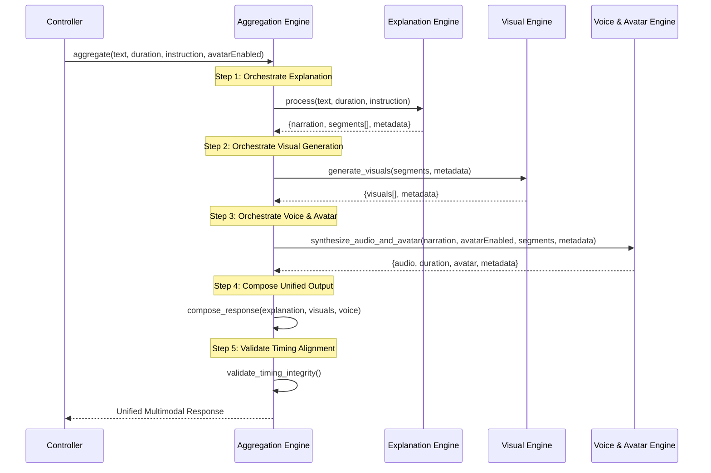

**This design is frozen for ConversAI V1.**  
**Any new capability belongs to V2+.**

# ConversAI V1 - Aggregation Engine Design

> [!IMPORTANT]
> This design defines the **Aggregation Engine** for ConversAI V1. The Aggregation Engine orchestrates existing engines (Explanation, Visual, Voice & Avatar) and combines their outputs into a single, unified, frontend-ready multimodal response.

---

## 1. Aggregation Engine Overview

### 1.1 Purpose

The Aggregation Engine is the **orchestration and composition layer** that:
- Calls existing engines in the correct sequence
- Combines their outputs into one unified response
- Aligns timing across narration, visuals, and audio
- Handles partial and complete failures gracefully
- Produces a frontend-ready multimodal payload

### 1.2 Core Principle

```
The Aggregation Engine is a PURE ORCHESTRATOR.
It does NOT generate content, call LLMs, or modify engine outputs.
It ONLY orchestrates, validates, and composes.
```

### 1.3 Architectural Position

```mermaid
graph TD
    Controller[ExplanationController] --> AGG[Aggregation Engine]
    AGG --> EE[Explanation Engine]
    AGG --> VE[Visual Engine]
    AGG --> VAE[Voice & Avatar Engine]
    
    EE --> |narration, segments, metadata| AGG
    VE --> |visuals[], metadata| AGG
    VAE --> |audio, duration, avatar| AGG
    
    AGG --> |unified multimodal output| Controller
    Controller --> |JSON response| Frontend
    
    style AGG fill:#ffd700,color:#333
    style EE fill:#7b68ee,color:#fff
    style VE fill:#ff6b6b,color:#fff
    style VAE fill:#51cf66,color:#fff
```

---

## 2. Responsibilities & Non-Responsibilities

### 2.1 Aggregation Engine Responsibilities

| Responsibility | Description |
|----------------|-------------|
| **Engine Orchestration** | Call Explanation → Visual → Voice engines in sequence |
| **Output Composition** | Combine engine outputs into unified response schema |
| **Timing Validation** | Ensure segment timings are consistent across engines |
| **Failure Detection** | Detect which engines succeeded/failed |
| **Graceful Degradation** | Handle partial failures (e.g., visuals fail but audio succeeds) |
| **Status Reporting** | Clearly indicate what succeeded, failed, or was skipped |
| **Duration Alignment** | Ensure audio duration matches expected segment timing |

### 2.2 Non-Responsibilities

The Aggregation Engine does **NOT**:
- ❌ Generate narration text
- ❌ Create visual prompts
- ❌ Synthesize audio
- ❌ Call LLMs or external APIs directly
- ❌ Modify engine outputs (narration, visuals, audio)
- ❌ Decide content structure
- ❌ Implement retry logic for engines (engines handle their own retries)
- ❌ Store or cache outputs

---

## 3. Inputs

### 3.1 Input from Controller

The Aggregation Engine receives the original user request:

```python
# Input Schema: AggregationRequest
{
  "text": str,               # Original text to explain
  "duration": str,           # "short" | "medium"
  "instruction": Optional[str],  # User instruction (e.g., "explain like I'm 5")
  "avatarEnabled": bool      # Whether to generate avatar metadata
}
```

### 3.2 Input Validation

```python
VALIDATION_RULES = {
    "text": {
        "required": True,
        "min_length": 10,
        "max_length": 5000
    },
    "duration": {
        "required": True,
        "allowed_values": ["short", "medium"]
    },
    "instruction": {
        "required": False,
        "max_length": 200
    },
    "avatarEnabled": {
        "required": True,
        "type": bool
    }
}
```

---

## 4. Aggregation Flow (Step-by-Step)

### 4.1 High-Level Flow



### 4.2 Detailed Orchestration Steps

#### Step 1: Orchestrate Explanation Engine

```python
# Call Explanation Engine
try:
    explanation_output = await explanation_engine.process(
        text=request.text,
        duration=request.duration,
        instruction=request.instruction
    )
    
    # Validate output
    assert "narration" in explanation_output
    assert "segments" in explanation_output
    assert len(explanation_output["segments"]) > 0
    
except Exception as e:
    # CRITICAL: If explanation fails, entire aggregation fails
    raise AggregationError(f"Explanation engine failed: {e}")
```

**Failure Mode**: If Explanation Engine fails, the entire aggregation **MUST FAIL** (no content to work with).

---

#### Step 2: Orchestrate Visual Engine

```python
# Call Visual Engine
try:
    visual_output = await visual_engine.generate_visuals(
        segments=explanation_output["segments"],
        metadata=explanation_output["metadata"]
    )
    
    # Visuals are OPTIONAL, partial success is acceptable
    visuals = visual_output.get("visuals", [])
    visual_failures = visual_output.get("metadata", {}).get("failures", [])
    
except Exception as e:
    # NON-CRITICAL: Visual engine failure does not fail aggregation
    logger.warning(f"Visual engine failed: {e}")
    visuals = []
    visual_failures = [{"error": str(e)}]
```

**Failure Mode**: If Visual Engine fails completely or partially, aggregation **CONTINUES** with audio-only output.

---

#### Step 3: Orchestrate Voice & Avatar Engine

```python
# Call Voice & Avatar Engine
try:
    voice_output = await voice_engine.synthesize_audio_and_avatar(
        narration=explanation_output["narration"],
        avatar_enabled=request.avatarEnabled,
        segments=explanation_output["segments"],
        metadata=explanation_output["metadata"]
    )
    
    # Validate critical fields
    assert "audio" in voice_output
    assert "duration" in voice_output
    
    # Avatar is optional
    avatar = voice_output.get("avatar", None)
    
except Exception as e:
    # CRITICAL: If voice fails, entire aggregation fails
    raise AggregationError(f"Voice engine failed: {e}")
```

**Failure Mode**: If Voice Engine fails, the entire aggregation **MUST FAIL** (narration is core to ConversAI).

---

#### Step 4: Compose Unified Response

```python
def compose_response(
    explanation_output: dict,
    visual_output: dict,
    voice_output: dict
) -> dict:
    """Compose unified multimodal response."""
    
    # Align segments with visuals (by timing)
    aligned_segments = align_segments_with_visuals(
        segments=explanation_output["segments"],
        visuals=visual_output.get("visuals", [])
    )
    
    # Attach audio and avatar
    unified_output = {
        "narration": explanation_output["narration"],
        "segments": aligned_segments,
        "audio": voice_output["audio"],
        "audioDuration": voice_output["duration"],
        "avatar": voice_output.get("avatar"),
        "metadata": compose_metadata(explanation_output, visual_output, voice_output)
    }
    
    return unified_output
```

---

#### Step 5: Validate Timing Integrity

```python
def validate_timing_integrity(unified_output: dict) -> None:
    """Ensure timing consistency across segments, visuals, and audio."""
    
    # Check 1: Segment timing continuity
    segments = unified_output["segments"]
    for i, segment in enumerate(segments):
        if i == 0:
            assert segment["startTime"] == 0
        else:
            assert segment["startTime"] == segments[i-1]["endTime"]
    
    # Check 2: Audio duration matches segment timeline
    last_segment = segments[-1]
    estimated_duration = last_segment["endTime"]
    actual_duration = unified_output["audioDuration"]
    
    # Allow up to 20% variance (gTTS may differ slightly from estimate)
    tolerance = 0.20
    if not (0.8 * estimated_duration <= actual_duration <= 1.2 * estimated_duration):
        logger.warning(
            f"Audio duration mismatch: "
            f"estimated={estimated_duration}s, actual={actual_duration}s"
        )
    
    # Check 3: Visuals align with segment timing
    for segment in segments:
        visual = segment.get("visual")
        if visual:
            assert visual["startTime"] == segment["startTime"]
            assert visual["endTime"] == segment["endTime"]
```

---

### 4.3 Flow Pseudocode

```python
async def aggregate(
    text: str,
    duration: str,
    instruction: Optional[str],
    avatar_enabled: bool
) -> dict:
    """
    Orchestrate all engines and compose unified output.
    """
    
    start_time = time.time()
    
    # Step 1: Orchestrate Explanation Engine (CRITICAL)
    explanation_output = await call_explanation_engine(text, duration, instruction)
    
    # Step 2: Orchestrate Visual Engine (OPTIONAL)
    visual_output = await call_visual_engine_safe(
        explanation_output["segments"],
        explanation_output["metadata"]
    )
    
    # Step 3: Orchestrate Voice Engine (CRITICAL)
    voice_output = await call_voice_engine(
        explanation_output["narration"],
        avatar_enabled,
        explanation_output["segments"],
        explanation_output["metadata"]
    )
    
    # Step 4: Compose unified response
    unified_output = compose_response(
        explanation_output,
        visual_output,
        voice_output
    )
    
    # Step 5: Validate timing
    validate_timing_integrity(unified_output)
    
    # Step 6: Attach aggregation metadata
    unified_output["aggregationMetadata"] = {
        "totalTime": time.time() - start_time,
        "explanationSuccess": True,
        "visualSuccess": len(visual_output.get("visuals", [])) > 0,
        "voiceSuccess": True,
        "avatarSuccess": voice_output.get("avatar") is not None,
        "failures": collect_failures(visual_output)
    }
    
    return unified_output
```

---

## 5. Output Schema (Final API Response)

### 5.1 Unified Response Schema

```python
# Output Type: AggregatedMultimodalResponse
{
  "narration": str,                # Full narration text
  "segments": List[AlignedSegment], # Segments with visuals attached
  "audio": str,                    # Base64 encoded audio
  "audioDuration": float,          # Actual audio duration (seconds)
  "avatar": Optional[AvatarData],  # Avatar metadata if enabled
  "metadata": AggregationMetadata  # Status and metadata
}
```

### 5.2 Aligned Segment Schema

```python
# AlignedSegment Type
{
  "id": str,              # "segment_1", "segment_2", ...
  "text": str,            # Narration text for this segment
  "startTime": float,     # seconds
  "endTime": float,       # seconds
  "visual": Optional[Visual]  # Attached visual if available
}

# Visual Type (from Visual Engine)
{
  "url": str,             # base64 data URI
  "startTime": float,     # Same as segment startTime
  "endTime": float,       # Same as segment endTime
  "type": str,            # Visual type (e.g., "metaphor", "process_flow")
  "metadata": {
    "segmentId": str,
    "concept": str,
    "generationTime": float
  }
}
```

### 5.3 Aggregation Metadata Schema

```python
# AggregationMetadata Type
{
  "totalTime": float,          # Total aggregation time (seconds)
  "explanationSuccess": bool,  # Always true (else aggregation fails)
  "visualSuccess": bool,       # True if at least 1 visual generated
  "voiceSuccess": bool,        # Always true (else aggregation fails)
  "avatarSuccess": bool,       # True if avatar metadata generated
  "visualStats": {
    "requested": int,          # Total segments
    "generated": int,          # Successfully generated visuals
    "failed": int              # Failed visual generations
  },
  "failures": List[Failure]    # Details of any failures
}

# Failure Type
{
  "component": str,      # "visual_engine" | "voice_engine" | "avatar_engine"
  "segmentId": Optional[str],  # If failure is segment-specific
  "reason": str,         # Error message
  "isCritical": bool     # Whether this failure blocks aggregation
}
```

---

## 6. Timing Alignment Strategy

### 6.1 Segment Timeline

All timing is based on the **Explanation Engine's segment timeline**:

```
Segment 1:  [0.0s ─────── 12.8s]
Segment 2:  [12.8s ────── 24.0s]
Segment 3:  [24.0s ────── 33.6s]
```

### 6.2 Visual Alignment

Visuals are aligned **1:1 with segments** by `startTime` and `endTime`:

```python
def align_segments_with_visuals(segments: List[Segment], visuals: List[Visual]) -> List[AlignedSegment]:
    """Attach visuals to corresponding segments by segmentId."""
    
    # Create lookup map: segmentId -> visual
    visual_map = {v["metadata"]["segmentId"]: v for v in visuals}
    
    aligned_segments = []
    for segment in segments:
        aligned_segment = {
            "id": segment["id"],
            "text": segment["text"],
            "startTime": segment["startTime"],
            "endTime": segment["endTime"],
            "visual": visual_map.get(segment["id"])  # None if visual failed
        }
        aligned_segments.append(aligned_segment)
    
    return aligned_segments
```

**Result**: Each segment either has a visual attached or `visual: null`.

---

### 6.3 Audio Alignment

The audio covers the **entire narration timeline**:

```python
# Audio timeline
audio_start = 0.0
audio_end = voice_output["duration"]  # Actual duration from gTTS

# Expected duration (from Explanation Engine)
expected_duration = explanation_output["metadata"]["estimatedDuration"]

# Variance tolerance
if abs(audio_end - expected_duration) > 0.2 * expected_duration:
    logger.warning("Audio duration differs significantly from estimate")
```

**Strategy**: Use **actual audio duration** as the authoritative timeline.

---

### 6.4 Avatar Alignment

Avatar states are derived from segment timing and audio duration:

```python
# Avatar states (from Voice & Avatar Engine)
{
  "states": [
    {
      "startTime": 0.0,      # Matches segment_1.startTime
      "endTime": 12.8,       # Matches segment_1.endTime
      "state": "speaking",
      "intensity": "medium"
    },
    {
      "startTime": 12.8,     # Matches segment_2.startTime
      "endTime": 24.0,       # Matches segment_2.endTime
      "state": "speaking",
      "intensity": "high"
    }
  ]
}
```

**Strategy**: Avatar states are **pre-aligned** by Voice & Avatar Engine using segment timing.

---

### 6.5 Timing Summary

| Component | Timing Source | Alignment Strategy |
|-----------|---------------|-------------------|
| **Segments** | Explanation Engine (authoritative) | Defines the timeline |
| **Visuals** | Visual Engine inherits segment timing | 1:1 mapping by `segmentId` |
| **Audio** | Voice Engine (actual duration) | Spans entire timeline |
| **Avatar** | Voice & Avatar Engine | Derived from segment timing |

---

## 7. Failure Handling Matrix

### 7.1 Engine Failure Modes

| Engine | Failure Mode | Aggregation Behavior | Final Result |
|--------|--------------|----------------------|--------------|
| **Explanation Engine** | Complete failure | **FAIL** aggregation | Return error to user |
| **Visual Engine** | Complete failure | Continue with audio-only | Success (no visuals) |
| **Visual Engine** | Partial failure | Attach successful visuals | Success (partial visuals) |
| **Voice Engine** | Complete failure | **FAIL** aggregation | Return error to user |
| **Avatar Engine** | Failure | Continue without avatar | Success (no avatar) |

### 7.2 Critical vs. Non-Critical Failures

```python
CRITICAL_ENGINES = ["explanation", "voice"]  # Must succeed
OPTIONAL_ENGINES = ["visual", "avatar"]      # Can fail gracefully
```

### 7.3 Failure Handling Logic

```python
def handle_visual_failure(error: Exception) -> dict:
    """Handle visual engine failure gracefully."""
    logger.warning(f"Visual engine failed: {error}")
    return {
        "visuals": [],
        "metadata": {
            "totalRequested": 0,
            "totalGenerated": 0,
            "failures": [
                {
                    "component": "visual_engine",
                    "reason": str(error),
                    "isCritical": False
                }
            ]
        }
    }

def handle_critical_failure(engine_name: str, error: Exception):
    """Handle critical engine failure."""
    logger.error(f"{engine_name} engine failed: {error}")
    raise AggregationError(
        f"Critical component '{engine_name}' failed: {error}",
        component=engine_name,
        original_error=error
    )
```

### 7.4 Partial Visual Failure

When some visuals succeed and others fail:

```python
# Example: 3 segments, 2 visuals succeeded, 1 failed

aligned_segments = [
    {
        "id": "segment_1",
        "text": "...",
        "startTime": 0.0,
        "endTime": 12.8,
        "visual": { ... }  # SUCCESS
    },
    {
        "id": "segment_2",
        "text": "...",
        "startTime": 12.8,
        "endTime": 24.0,
        "visual": null     # FAILED
    },
    {
        "id": "segment_3",
        "text": "...",
        "startTime": 24.0,
        "endTime": 33.6,
        "visual": { ... }  # SUCCESS
    }
]

metadata = {
    "visualSuccess": True,  # At least 1 visual succeeded
    "visualStats": {
        "requested": 3,
        "generated": 2,
        "failed": 1
    },
    "failures": [
        {
            "component": "visual_engine",
            "segmentId": "segment_2",
            "reason": "API timeout after retries",
            "isCritical": False
        }
    ]
}
```

---

## 8. Example Aggregated Response

### 8.1 Full Success Example

**Request:**
```json
{
  "text": "Quantum entanglement is a phenomenon where two particles become interconnected...",
  "duration": "short",
  "instruction": null,
  "avatarEnabled": true
}
```

**Response:**
```json
{
  "narration": "Imagine you have two magic coins. No matter how far apart they are—even across the universe—when you flip one and it lands on heads, the other instantly lands on tails. That's quantum entanglement in a nutshell. Two particles become so deeply connected that measuring one immediately reveals something about the other. Einstein found this so bizarre he called it 'spooky action at a distance.' And here's the kicker: this isn't just a physics curiosity—it's powering the future of computing and unbreakable encryption.",
  "segments": [
    {
      "id": "segment_1",
      "text": "Imagine you have two magic coins. No matter how far apart they are—even across the universe—when you flip one and it lands on heads, the other instantly lands on tails. That's quantum entanglement in a nutshell.",
      "startTime": 0,
      "endTime": 12.8,
      "visual": {
        "url": "data:image/png;base64,iVBORw0KGgoAAAANSUhEUgAA...",
        "startTime": 0,
        "endTime": 12.8,
        "type": "metaphor",
        "metadata": {
          "segmentId": "segment_1",
          "concept": "quantum entanglement",
          "generationTime": 3.2
        }
      }
    },
    {
      "id": "segment_2",
      "text": "Two particles become so deeply connected that measuring one immediately reveals something about the other. Einstein found this so bizarre he called it 'spooky action at a distance.'",
      "startTime": 12.8,
      "endTime": 24.0,
      "visual": {
        "url": "data:image/png;base64,iVBORw0KGgoAAAANSUhEUgAB...",
        "startTime": 12.8,
        "endTime": 24.0,
        "type": "metaphor",
        "metadata": {
          "segmentId": "segment_2",
          "concept": "spooky action at a distance",
          "generationTime": 4.1
        }
      }
    },
    {
      "id": "segment_3",
      "text": "And here's the kicker: this isn't just a physics curiosity—it's powering the future of computing and unbreakable encryption.",
      "startTime": 24.0,
      "endTime": 33.6,
      "visual": {
        "url": "data:image/png;base64,iVBORw0KGgoAAAANSUhEUgAC...",
        "startTime": 24.0,
        "endTime": 33.6,
        "type": "abstract_concept",
        "metadata": {
          "segmentId": "segment_3",
          "concept": "quantum computing",
          "generationTime": 3.8
        }
      }
    }
  ],
  "audio": "data:audio/mp3;base64,//uQxAAAAAAAAAAAAAAASW5mb...",
  "audioDuration": 34.2,
  "avatar": {
    "states": [
      {
        "startTime": 0,
        "endTime": 12.8,
        "state": "speaking",
        "intensity": "medium"
      },
      {
        "startTime": 12.8,
        "endTime": 24.0,
        "state": "speaking",
        "intensity": "medium"
      },
      {
        "startTime": 24.0,
        "endTime": 33.6,
        "state": "speaking",
        "intensity": "low"
      }
    ],
    "cues": [
      {
        "timestamp": 0,
        "cueType": "segment_start",
        "metadata": { "segmentId": "segment_1" }
      },
      {
        "timestamp": 12.8,
        "cueType": "segment_start",
        "metadata": { "segmentId": "segment_2" }
      },
      {
        "timestamp": 24.0,
        "cueType": "segment_start",
        "metadata": { "segmentId": "segment_3" }
      }
    ],
    "metadata": {
      "totalDuration": 34.2,
      "stateCount": 3
    }
  },
  "metadata": {
    "totalTime": 18.7,
    "explanationSuccess": true,
    "visualSuccess": true,
    "voiceSuccess": true,
    "avatarSuccess": true,
    "visualStats": {
      "requested": 3,
      "generated": 3,
      "failed": 0
    },
    "failures": []
  }
}
```

---

### 8.2 Partial Visual Failure Example

**Scenario**: Explanation and Voice succeed, but 1 of 3 visuals fails.

**Response:**
```json
{
  "narration": "...",
  "segments": [
    {
      "id": "segment_1",
      "text": "...",
      "startTime": 0,
      "endTime": 12.8,
      "visual": { ... }  // SUCCESS
    },
    {
      "id": "segment_2",
      "text": "...",
      "startTime": 12.8,
      "endTime": 24.0,
      "visual": null     // FAILED
    },
    {
      "id": "segment_3",
      "text": "...",
      "startTime": 24.0,
      "endTime": 33.6,
      "visual": { ... }  // SUCCESS
    }
  ],
  "audio": "data:audio/mp3;base64,...",
  "audioDuration": 34.2,
  "avatar": { ... },
  "metadata": {
    "totalTime": 19.2,
    "explanationSuccess": true,
    "visualSuccess": true,
    "voiceSuccess": true,
    "avatarSuccess": true,
    "visualStats": {
      "requested": 3,
      "generated": 2,
      "failed": 1
    },
    "failures": [
      {
        "component": "visual_engine",
        "segmentId": "segment_2",
        "reason": "Replicate API timeout after retries",
        "isCritical": false
      }
    ]
  }
}
```

---

### 8.3 Complete Visual Failure Example

**Scenario**: All visuals fail, but audio succeeds.

**Response:**
```json
{
  "narration": "...",
  "segments": [
    {
      "id": "segment_1",
      "text": "...",
      "startTime": 0,
      "endTime": 12.8,
      "visual": null
    },
    {
      "id": "segment_2",
      "text": "...",
      "startTime": 12.8,
      "endTime": 24.0,
      "visual": null
    },
    {
      "id": "segment_3",
      "text": "...",
      "startTime": 24.0,
      "endTime": 33.6,
      "visual": null
    }
  ],
  "audio": "data:audio/mp3;base64,...",
  "audioDuration": 34.2,
  "avatar": { ... },
  "metadata": {
    "totalTime": 8.5,
    "explanationSuccess": true,
    "visualSuccess": false,
    "voiceSuccess": true,
    "avatarSuccess": true,
    "visualStats": {
      "requested": 3,
      "generated": 0,
      "failed": 3
    },
    "failures": [
      {
        "component": "visual_engine",
        "segmentId": null,
        "reason": "Visual engine initialization failed",
        "isCritical": false
      }
    ]
  }
}
```

---

### 8.4 Avatar Disabled Example

**Request:**
```json
{
  "text": "...",
  "duration": "short",
  "instruction": null,
  "avatarEnabled": false
}
```

**Response:**
```json
{
  "narration": "...",
  "segments": [...],
  "audio": "data:audio/mp3;base64,...",
  "audioDuration": 34.2,
  "avatar": null,
  "metadata": {
    "totalTime": 16.3,
    "explanationSuccess": true,
    "visualSuccess": true,
    "voiceSuccess": true,
    "avatarSuccess": false,
    "visualStats": { ... },
    "failures": []
  }
}
```

---

## 9. Performance & Scalability Notes

### 9.1 Sequential vs. Parallel Execution

**V1 Strategy: Sequential Execution**

```python
# Sequential orchestration (V1)
explanation_output = await call_explanation_engine(...)  # Wait
visual_output = await call_visual_engine(...)            # Wait
voice_output = await call_voice_engine(...)              # Wait
```

**Why sequential for V1:**
- Visual Engine depends on Explanation output (segments)
- Voice Engine depends on Explanation output (narration)
- Visual and Voice can run in parallel, but complexity outweighs benefit for V1
- Simple, predictable, debuggable flow

**V2 Optimization: Parallel Execution**

```python
# Future optimization (V2)
explanation_output = await call_explanation_engine(...)

# Visual and Voice can run in parallel (both depend only on explanation)
visual_task = asyncio.create_task(call_visual_engine(...))
voice_task = asyncio.create_task(call_voice_engine(...))

visual_output, voice_output = await asyncio.gather(visual_task, voice_task)
```

---

### 9.2 Expected Aggregation Times

```
Component Timing (approximate):
- Explanation Engine: 3-8 seconds (LLM call)
- Visual Engine: 15-40 seconds (3-5 visuals x 3-8s each)
- Voice Engine: 2-5 seconds (gTTS + encoding)

Total (sequential, V1):
- Best case: ~20 seconds
- Typical: ~30 seconds
- Worst case: ~50 seconds

Total (parallel Visual + Voice, V2):
- Best case: ~18 seconds
- Typical: ~25 seconds
- Worst case: ~45 seconds
```

**V1 Acceptance**: 20-50 seconds is acceptable for initial release.

---

### 9.3 Scalability Considerations

#### Current Limitations (V1)
1. **Sequential Processing**: No parallelization
2. **Blocking Calls**: Each engine call blocks until completion
3. **No Caching**: Every request regenerates everything
4. **Synchronous Visual Generation**: Visuals generated one at a time

#### Future Optimizations (V2+)
1. **Parallel Visual + Voice**: Run in parallel after Explanation
2. **Async Visual Generation**: Generate all visuals concurrently
3. **Result Caching**: Cache explanation + visuals for identical requests
4. **Streaming Responses**: Stream audio while visuals are generating
5. **CDN for Visuals**: Store visuals externally, return URLs instead of base64

---

## 10. How Controllers Should Change After This Engine

### 10.1 Current Controller Pattern (V1 Without Aggregation)

```python
# OLD: Controllers call engines independently (BAD)
@router.post("/api/explain")
async def explain_endpoint(request: ExplainRequest):
    # Controller orchestrates engines directly
    explanation = await explanation_engine.process(...)
    visuals = await visual_engine.generate_visuals(...)
    voice = await voice_engine.synthesize_audio_and_avatar(...)
    
    # Controller manually composes response
    response = {
        "narration": explanation["narration"],
        "segments": align_manually(explanation["segments"], visuals),
        "audio": voice["audio"],
        # ...
    }
    return response
```

**Problems:**
- ❌ Controller has orchestration logic (violates SRP)
- ❌ Timing alignment logic duplicated in controllers
- ❌ Hard to change engine call order or add new engines
- ❌ No centralized failure handling

---

### 10.2 New Controller Pattern (V1 With Aggregation)

```python
# NEW: Controllers delegate to Aggregation Engine (GOOD)
@router.post("/api/explain")
async def explain_endpoint(request: ExplainRequest):
    try:
        # Single call to aggregation engine
        response = await aggregation_engine.aggregate(
            text=request.text,
            duration=request.duration,
            instruction=request.instruction,
            avatar_enabled=request.avatarEnabled
        )
        
        return JSONResponse(content=response, status_code=200)
        
    except AggregationError as e:
        logger.error(f"Aggregation failed: {e}")
        return JSONResponse(
            content={"error": str(e)},
            status_code=500
        )
```

**Benefits:**
- ✅ Controller is thin, only handles HTTP concerns
- ✅ Aggregation logic centralized in one place
- ✅ Easy to add new engines or change orchestration
- ✅ Consistent failure handling
- ✅ Single source of truth for multimodal response schema

---

### 10.3 Controller Responsibilities After Aggregation Engine

| Responsibility | Controller | Aggregation Engine |
|----------------|------------|-------------------|
| HTTP request/response | ✅ Controller | ❌ |
| Input validation (HTTP level) | ✅ Controller | ❌ |
| Input validation (business logic) | ❌ | ✅ Aggregation Engine |
| Engine orchestration | ❌ | ✅ Aggregation Engine |
| Output composition | ❌ | ✅ Aggregation Engine |
| Error handling (engine failures) | ❌ | ✅ Aggregation Engine |
| Error handling (HTTP errors) | ✅ Controller | ❌ |
| Logging (HTTP layer) | ✅ Controller | ❌ |
| Logging (engine layer) | ❌ | ✅ Aggregation Engine |

---

## 11. Public Interface (Facade)

### 11.1 Facade Method

```python
# src/engines/aggregation/__init__.py

from typing import Optional
from src.shared.types import AggregatedMultimodalResponse

async def aggregate(
    text: str,
    duration: str,
    instruction: Optional[str] = None,
    avatar_enabled: bool = True
) -> AggregatedMultimodalResponse:
    """
    Orchestrate all engines and compose unified multimodal response.
    
    This is the ONLY public interface of the Aggregation Engine.
    
    Args:
        text: Original text to explain
        duration: "short" | "medium"
        instruction: Optional user instruction (e.g., "explain like I'm 5")
        avatar_enabled: Whether to generate avatar metadata
    
    Returns:
        AggregatedMultimodalResponse containing:
        - narration: Full narration text
        - segments: Aligned segments with visuals attached
        - audio: Base64 encoded audio
        - audioDuration: Actual audio duration
        - avatar: Optional avatar metadata
        - metadata: Aggregation status and metadata
    
    Raises:
        AggregationError: If critical engines (Explanation, Voice) fail
        ValidationError: If input validation fails
    """
    pass
```

---

### 11.2 Error Types

```python
class AggregationError(Exception):
    """Raised when critical aggregation failure occurs."""
    def __init__(self, message: str, component: str, original_error: Exception):
        super().__init__(message)
        self.component = component
        self.original_error = original_error

class ValidationError(Exception):
    """Raised when input validation fails."""
    pass
```

---

## 12. Summary

| Aspect | Design Decision |
|--------|--------------------|
| **Architecture** | Pure orchestrator, no content generation |
| **Engine Call Order** | Explanation → Visual → Voice (sequential for V1) |
| **Critical Engines** | Explanation, Voice (must succeed) |
| **Optional Engines** | Visual, Avatar (can fail gracefully) |
| **Timing Source** | Explanation Engine segment timeline (authoritative) |
| **Visual Alignment** | 1:1 mapping by `segmentId` |
| **Audio Alignment** | Spans entire timeline, actual duration used |
| **Avatar Alignment** | Pre-aligned by Voice & Avatar Engine |
| **Failure Strategy** | Fail-critical for Explanation/Voice, fail-soft for Visual/Avatar |
| **Output Format** | Unified multimodal JSON response |
| **Performance** | Sequential execution (20-50s typical) |

---

## 13. Final Notes

### 13.1 Design Principles

1. **Determinism**: Aggregation logic is predictable and testable
2. **Fail-Safe**: Partial failures don't break the entire system
3. **Composability**: Easy to add new engines or modify orchestration
4. **Clarity**: Metadata clearly indicates what succeeded/failed
5. **Simplicity**: No premature optimization (sequential is fine for V1)

### 13.2 What This Design Enables

- ✅ Frontend receives a single, complete multimodal response
- ✅ Consistent timing across narration, visuals, and audio
- ✅ Graceful handling of visual failures (audio-only fallback)
- ✅ Clear status reporting for debugging
- ✅ Easy to extend with new engines in V2+

### 13.3 What This Design Prevents

- ❌ Controllers managing engine orchestration
- ❌ Inconsistent timing between components
- ❌ Complete failure due to non-critical engine issues
- ❌ Duplicate composition logic across controllers
- ❌ Ambiguous error states

---

**This design is frozen for ConversAI V1.**  
**Implementation can proceed based on this contract.**
