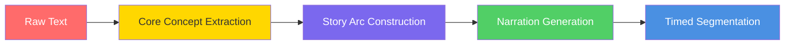
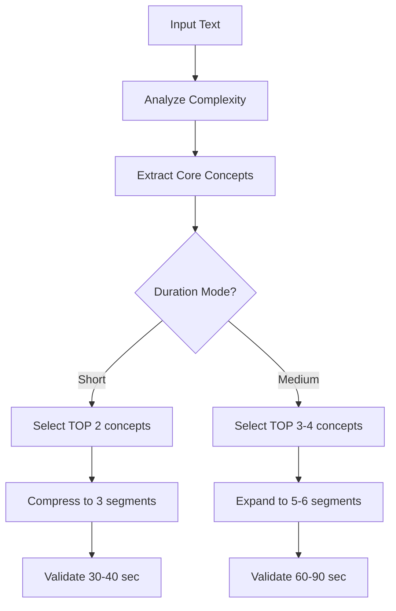
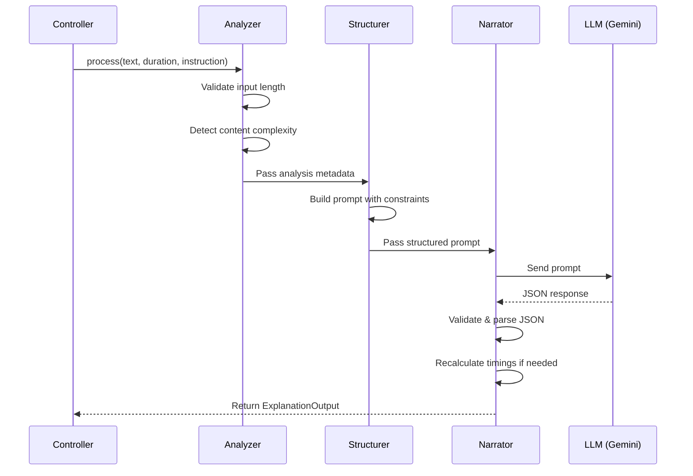
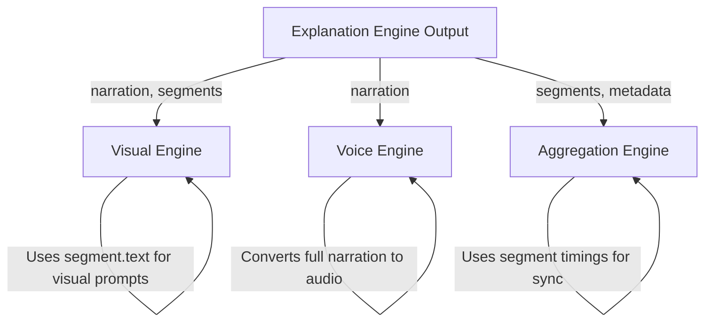

**This implementation is frozen for ConversAI V1.**
**Further improvements belong to V1.x or V2.**

# ConversAI V1 - Explanation Engine Design

> [!IMPORTANT]
> This design defines the **core intelligence** of ConversAI. The Explanation Engine transforms raw text into story-driven narration with structured segments for downstream consumption.

---

## 1. Explanation Strategy

The Explanation Engine follows a **Story-Driven Transformation** approach that converts dense, text-heavy content into an engaging narrated explanation.

### 1.1 Core Philosophy



### 1.2 Transformation Principles

| Principle | Description |
|-----------|-------------|
| **Focus, Don't Summarize** | Extract 2-4 core concepts. Ignore peripheral details. |
| **Story Flow** | Every explanation follows: Setup → Insight → Takeaway |
| **Conversational Tone** | Write for speaking, not reading. Use natural language. |
| **Concrete over Abstract** | Use analogies, examples, and relatable scenarios. |
| **Time Awareness** | Content must fit within selected duration constraints. |

### 1.3 Story-Driven Flow Structure

Every explanation follows a **three-act narrative structure**:

```
┌─────────────────────────────────────────────────────────────┐
│ ACT 1: SETUP (≈20% of duration)                             │
│ • Hook the listener with a relatable question or scenario   │
│ • Establish WHY this matters                                │
│ • Set context without overwhelming                          │
└─────────────────────────────────────────────────────────────┘
                            ↓
┌─────────────────────────────────────────────────────────────┐
│ ACT 2: INSIGHT (≈60% of duration)                           │
│ • Explain core concepts progressively                       │
│ • Use 1-2 concrete analogies or examples                    │
│ • Build understanding step-by-step                          │
│ • Connect ideas logically                                   │
└─────────────────────────────────────────────────────────────┘
                            ↓
┌─────────────────────────────────────────────────────────────┐
│ ACT 3: TAKEAWAY (≈20% of duration)                          │
│ • Summarize the key insight in one memorable sentence       │
│ • Connect back to real-world application                    │
│ • End with a thought-provoking closer                       │
└─────────────────────────────────────────────────────────────┘
```

---

## 2. Segmentation Logic

Segments are the atomic units of the explanation, each designed to pair with a single visual and audio chunk.

### 2.1 Segmentation Rules

```python
# Pseudocode for segmentation logic

SEGMENT_RULES = {
    "short": {
        "target_segments": 3,        # Setup, Insight, Takeaway
        "min_segments": 2,
        "max_segments": 4,
        "words_per_segment": 25-40,  # ~6-10 seconds each
        "total_duration": 30-40      # seconds
    },
    "medium": {
        "target_segments": 5,        # Setup, 3x Insight, Takeaway
        "min_segments": 4,
        "max_segments": 7,
        "words_per_segment": 30-50,  # ~8-15 seconds each
        "total_duration": 60-90      # seconds
    }
}
```

### 2.2 Segment Boundaries

Segments should break at **natural narrative boundaries**:

1. **Conceptual Shifts**: When moving from one core concept to another
2. **Logical Connectors**: After transition words (e.g., "Now", "Next", "However")
3. **Complete Thoughts**: Never mid-sentence or mid-idea
4. **Visual Cue Points**: Where a new image/diagram would naturally appear

### 2.3 Segment ID Naming Convention

```json
{
  "id": "segment_1",  // Always sequential: segment_1, segment_2, ...
  "role": "setup"     // Optional metadata: setup | insight | takeaway
}
```

### 2.4 Segment Timing Algorithm

```
Words per segment → Speaking rate → Duration

Speaking Rate: ~150 words/minute (natural conversational pace)
Formula: duration_seconds = (word_count / 150) * 60

Example:
  - 40 words → 16 seconds
  - 25 words → 10 seconds
```

**Timing Calculation Logic:**

```python
def calculate_segment_times(segments: list[str]) -> list[dict]:
    """Calculate startTime and endTime for each segment."""
    SPEAKING_RATE = 150  # words per minute
    
    result = []
    current_time = 0.0
    
    for i, text in enumerate(segments):
        word_count = len(text.split())
        duration = (word_count / SPEAKING_RATE) * 60
        
        result.append({
            "id": f"segment_{i + 1}",
            "text": text,
            "startTime": round(current_time, 1),
            "endTime": round(current_time + duration, 1)
        })
        
        current_time += duration
    
    return result
```

---

## 3. Duration Control Logic

### 3.1 Duration Profiles

| Duration | Total Time | Word Count | Segments | Use Case |
|----------|------------|------------|----------|----------|
| **Short** | 30-40 sec | 75-100 words | 2-4 | Quick overview, TL;DR |
| **Medium** | 60-90 sec | 150-225 words | 4-7 | Full explanation with examples |

### 3.2 Content Scaling Strategy



### 3.3 Duration Enforcement Rules

1. **Word Budget**: LLM prompt includes explicit word limits
2. **Segment Count Constraint**: Max segments capped per duration
3. **Concept Prioritization**: Only top N concepts based on duration
4. **Expansion/Compression**: Medium mode adds examples; Short mode removes them

### 3.4 Handling Edge Cases

| Scenario | Strategy |
|----------|----------|
| Very short input (<200 chars) | Add context/analogy to meet minimum duration |
| Very long input (>3000 chars) | Aggressive filtering to 2-3 core concepts |
| Technical jargon | Simplify or define inline, don't skip |
| Multiple distinct topics | Focus on primary topic only |

---

## 4. LLM Prompt Template

### 4.1 System Prompt (Static)

```text
You are the Explanation Engine for ConversAI, a system that transforms text into engaging narrated explanations.

YOUR ROLE:
- Transform dense text into a story-driven narration
- Focus on core ideas only (2-4 concepts maximum)
- Make content accessible to the specified audience level
- Write for SPEAKING, not reading

STRICT OUTPUT FORMAT:
You MUST return a valid JSON object with this exact structure:
{
  "narration": "The complete narration text as a single string",
  "segments": [
    {
      "id": "segment_1",
      "text": "The narration text for this segment only",
      "startTime": 0,
      "endTime": <calculated_end_time>
    }
  ],
  "metadata": {
    "concepts": ["concept1", "concept2"],
    "difficulty": "beginner" | "intermediate",
    "estimatedDuration": <total_seconds>
  }
}

NARRATION RULES:
1. Follow the structure: SETUP → INSIGHT → TAKEAWAY
2. Use natural, conversational language
3. Include 1-2 concrete analogies or examples
4. Avoid jargon unless essential (then define it)
5. End with a memorable takeaway

SEGMENT RULES:
1. Each segment = one visual scene
2. Break at natural thought boundaries
3. Timing: ~150 words = 60 seconds
4. startTime of segment N = endTime of segment N-1
5. First segment always starts at 0

FORBIDDEN:
- Do NOT include everything from the input
- Do NOT use bullet points in narration
- Do NOT make segments too short (<5 sec) or too long (>20 sec)
- Do NOT include meta-commentary like "In this explanation..."
```

### 4.2 User Prompt Template

```text
TRANSFORM THE FOLLOWING TEXT INTO A NARRATED EXPLANATION.

--- INPUT TEXT ---
{text}
--- END INPUT ---

CONSTRAINTS:
- Duration: {duration} ({duration_description})
- Word Budget: {word_min}-{word_max} words total
- Segment Count: {segment_min}-{segment_max} segments
{instruction_block}

OUTPUT REQUIREMENTS:
1. Extract the {concept_count} most important concepts
2. Structure as: Setup ({setup_pct}%) → Insight ({insight_pct}%) → Takeaway ({takeaway_pct}%)
3. Each segment should be {words_per_segment} words on average
4. Calculate timings at 150 words per minute speaking rate

Return ONLY the JSON object. No additional text.
```

### 4.3 Template Variable Values

```python
PROMPT_VARIABLES = {
    "short": {
        "duration_description": "30-40 seconds, quick overview",
        "word_min": 75,
        "word_max": 100,
        "segment_min": 2,
        "segment_max": 4,
        "concept_count": 2,
        "setup_pct": 20,
        "insight_pct": 60,
        "takeaway_pct": 20,
        "words_per_segment": "25-35"
    },
    "medium": {
        "duration_description": "60-90 seconds, full explanation with examples",
        "word_min": 150,
        "word_max": 225,
        "segment_min": 4,
        "segment_max": 7,
        "concept_count": 3,
        "setup_pct": 15,
        "insight_pct": 70,
        "takeaway_pct": 15,
        "words_per_segment": "30-45"
    }
}
```

### 4.4 Instruction Handling

When the user provides an `instruction`:

```text
{instruction_block} = """
ADDITIONAL USER INSTRUCTION:
{instruction}

Apply this instruction to the tone, complexity, and style of the narration.
"""
```

Example instructions and their effects:

| Instruction | Effect on Output |
|-------------|------------------|
| "Explain like I'm 5" | Use simple words, playful analogies, short sentences |
| "For a tech professional" | Include technical terms, skip basic context |
| "Make it funny" | Add humor, use witty analogies |
| "Focus on practical use" | Emphasize applications over theory |

---

## 5. Component Pipeline

### 5.1 Internal Processing Flow



### 5.2 Module Responsibilities

| Module | Responsibility |
|--------|----------------|
| `analyzer.py` | Input validation, complexity detection, concept pre-scan |
| `structurer.py` | Duration constraints, prompt template assembly |
| `narrator.py` | LLM invocation (Gemini/Ollama), response parsing, timing calculation |

---

## 6. Example Input/Output

### 6.1 Example: Short Duration

**Input:**
```json
{
  "text": "Quantum entanglement is a phenomenon in quantum physics where two particles become interconnected and the quantum state of one instantly influences the other, regardless of the distance between them. This occurs because the particles share a quantum state. When measured, if one particle is found to have a certain property, the other will have a correlated property. Einstein called this 'spooky action at a distance' because it seems to violate the principle that nothing can travel faster than light. However, no actual information is transmitted faster than light. Entanglement is used in quantum computing, quantum cryptography, and quantum teleportation experiments.",
  "duration": "short",
  "instruction": null
}
```

**Output:**
```json
{
  "narration": "Imagine you have two magic coins. No matter how far apart they are—even across the universe—when you flip one and it lands on heads, the other instantly lands on tails. That's quantum entanglement in a nutshell. Two particles become so deeply connected that measuring one immediately reveals something about the other. Einstein found this so bizarre he called it 'spooky action at a distance.' And here's the kicker: this isn't just a physics curiosity—it's powering the future of computing and unbreakable encryption.",
  "segments": [
    {
      "id": "segment_1",
      "text": "Imagine you have two magic coins. No matter how far apart they are—even across the universe—when you flip one and it lands on heads, the other instantly lands on tails. That's quantum entanglement in a nutshell.",
      "startTime": 0,
      "endTime": 12.8
    },
    {
      "id": "segment_2",
      "text": "Two particles become so deeply connected that measuring one immediately reveals something about the other. Einstein found this so bizarre he called it 'spooky action at a distance.'",
      "startTime": 12.8,
      "endTime": 24.0
    },
    {
      "id": "segment_3",
      "text": "And here's the kicker: this isn't just a physics curiosity—it's powering the future of computing and unbreakable encryption.",
      "startTime": 24.0,
      "endTime": 33.6
    }
  ],
  "metadata": {
    "concepts": ["quantum entanglement", "spooky action at a distance"],
    "difficulty": "beginner",
    "estimatedDuration": 33.6
  }
}
```

---

### 6.2 Example: Medium Duration with Instruction

**Input:**
```json
{
  "text": "Machine learning is a subset of artificial intelligence that enables systems to learn and improve from experience without being explicitly programmed. It focuses on developing algorithms that can access data and use it to learn for themselves. The learning process begins with observations or data, such as examples or direct experience, to look for patterns in data and make better decisions in the future. The primary aim is to allow computers to learn automatically without human intervention. Machine learning algorithms are categorized as supervised, unsupervised, or reinforcement learning. Supervised learning uses labeled data, unsupervised learning finds hidden patterns, and reinforcement learning learns from trial and error with rewards.",
  "duration": "medium",
  "instruction": "Explain like I'm a high school student"
}
```

**Output:**
```json
{
  "narration": "Ever wondered how Netflix knows exactly what show you'll binge next? That's machine learning in action—and it's simpler than you think. Machine learning is basically teaching computers to learn from examples, just like how you learned to recognize your friends' faces. You didn't memorize every pixel of their face—your brain found patterns. That's exactly what ML does with data. Here's how it works: you feed a computer tons of examples—like thousands of photos labeled 'cat' or 'dog.' The algorithm looks for patterns, like pointy ears or wet noses, and learns to tell them apart. This is called supervised learning—learning with labeled answers. But there's also unsupervised learning, where the computer finds hidden patterns on its own, like grouping similar songs together. And then there's reinforcement learning—where the computer learns by trial and error, like a video game character figuring out how to beat a level. So next time your phone suggests the perfect emoji or Spotify nails your vibe, you'll know—it's machine learning, quietly learning you.",
  "segments": [
    {
      "id": "segment_1",
      "text": "Ever wondered how Netflix knows exactly what show you'll binge next? That's machine learning in action—and it's simpler than you think.",
      "startTime": 0,
      "endTime": 9.6
    },
    {
      "id": "segment_2",
      "text": "Machine learning is basically teaching computers to learn from examples, just like how you learned to recognize your friends' faces. You didn't memorize every pixel of their face—your brain found patterns. That's exactly what ML does with data.",
      "startTime": 9.6,
      "endTime": 26.4
    },
    {
      "id": "segment_3",
      "text": "Here's how it works: you feed a computer tons of examples—like thousands of photos labeled 'cat' or 'dog.' The algorithm looks for patterns, like pointy ears or wet noses, and learns to tell them apart. This is called supervised learning—learning with labeled answers.",
      "startTime": 26.4,
      "endTime": 45.6
    },
    {
      "id": "segment_4",
      "text": "But there's also unsupervised learning, where the computer finds hidden patterns on its own, like grouping similar songs together. And then there's reinforcement learning—where the computer learns by trial and error, like a video game character figuring out how to beat a level.",
      "startTime": 45.6,
      "endTime": 64.0
    },
    {
      "id": "segment_5",
      "text": "So next time your phone suggests the perfect emoji or Spotify nails your vibe, you'll know—it's machine learning, quietly learning you.",
      "startTime": 64.0,
      "endTime": 75.2
    }
  ],
  "metadata": {
    "concepts": ["machine learning", "supervised learning", "unsupervised learning", "reinforcement learning"],
    "difficulty": "beginner",
    "estimatedDuration": 75.2
  }
}
```

---

## 7. Validation & Error Handling

### 7.1 Output Validation Rules

```python
def validate_explanation_output(output: dict, duration: str) -> bool:
    """Validate the LLM output meets all requirements."""
    
    constraints = PROMPT_VARIABLES[duration]
    
    # Check required fields
    assert "narration" in output
    assert "segments" in output
    assert "metadata" in output
    
    # Check segment constraints
    assert constraints["segment_min"] <= len(output["segments"]) <= constraints["segment_max"]
    
    # Check word count
    word_count = len(output["narration"].split())
    assert constraints["word_min"] <= word_count <= constraints["word_max"] * 1.2  # 20% tolerance
    
    # Check timing continuity
    for i, seg in enumerate(output["segments"]):
        if i == 0:
            assert seg["startTime"] == 0
        else:
            assert seg["startTime"] == output["segments"][i-1]["endTime"]
    
    # Check estimated duration
    expected_duration = (word_count / 150) * 60
    assert 0.8 * expected_duration <= output["metadata"]["estimatedDuration"] <= 1.2 * expected_duration
    
    return True
```

### 7.2 Fallback Strategies

| Failure Mode | Recovery Strategy |
|--------------|-------------------|
| LLM returns invalid JSON | Retry with stricter prompt + JSON repair |
| Too many/few segments | Recalculate timings, merge/split segments |
| Duration out of bounds | Trim narration or request regeneration |
| Missing concepts | Use input text's key nouns as fallback |

---

## 8. Integration with Downstream Engines

### 8.1 Output Consumption Map



### 8.2 Visual Engine Handoff

The Visual Engine receives:
- `segments`: Each segment's `text` is analyzed to determine visual type
- `metadata.concepts`: Used for thematic consistency in visuals
- `metadata.difficulty`: Affects visual complexity (simple icons vs. detailed diagrams)

### 8.3 Voice Engine Handoff

The Voice Engine receives:
- `narration`: The complete narration text for TTS generation
- Duration is implicitly defined by the narration length

### 8.4 Aggregation Engine Handoff

The Aggregation Engine uses:
- `segments[].startTime` and `segments[].endTime`: For audio-visual synchronization
- `metadata.estimatedDuration`: For timeline validation

---

## 9. Summary

| Aspect | Design Decision |
|--------|-----------------|
| **Strategy** | Story-driven (Setup → Insight → Takeaway) |
| **Segmentation** | Natural thought boundaries, 2-7 segments |
| **Duration Control** | Word budgets + segment limits per mode |
| **Timing** | 150 words/min speaking rate |
| **LLM** | Google Gemini (default) or Ollama (fallback) |
| **Output** | Strict contract for downstream engines |

This design ensures ConversAI delivers engaging, time-appropriate explanations while maintaining clear boundaries with downstream engines.
