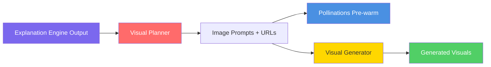

**This design reflects the IMPLEMENTED state of ConversAI V1.**

# ConversAI V1 - Visual Engine Design

> [!IMPORTANT]
> This design defines the **Visual Engine** for ConversAI. The Visual Engine transforms narrated explanation segments into real **AI-generated cinematic images** via Pollinations.ai that reduce cognitive load and enhance understanding.

> [!NOTE]
> **Implementation Update**: The original design specified FLUX.1-dev via Replicate API for image generation. The **actual implementation** uses **Google Gemini** for image prompt generation and **Pollinations.ai** as the free, zero-cost AI image CDN. This change delivers better results with no API costs and no rate limits.

---

## 1. Visual Engine Overview

The Visual Engine is a **single backend engine** with two internal components that work sequentially:

1. **Visual Planner** (`planner.py`) - Uses Gemini to generate vivid image prompts for each segment, then builds Pollinations.ai CDN URLs and pre-warms them
2. **Visual Generator** (`generator.py`) - Constructs the final Visual objects with URLs, headlines, and timing metadata



### 1.1 Design Philosophy

```
Good visuals for ConversAI are:
  ✓ Cinematic, scene-based images (not diagrams)
  ✓ Generated by AI for every unique explanation
  ✓ 16:9 format matching the player aspect ratio
  ✓ Support the narration, not replace it
  ✓ No text in images (narration provides text)
  
Bad visuals for ConversAI are:
  ✗ Text-heavy (narration already provides text)
  ✗ Static placeholders or stock photos
  ✗ Slow to load (must be CDN-cached)
  ✗ Portrait orientation (breaks 16:9 layout)
```

---

## 2. Internal Components

### 2.1 Visual Planner (`planner.py`)

**Purpose**: Generate vivid image prompts via Gemini for each narration segment, build Pollinations.ai URLs, and pre-warm the CDN cache.

**Responsibilities**:
- Receive explanation output (narration segments + metadata)
- Call Gemini API with a documentary filmmaker system prompt
- Receive 6 structured image prompts (one per segment): `imagePrompt`, `style`, `headline`, `segmentId`
- Build Pollinations.ai URLs from each prompt
- **Pre-warm all URLs concurrently** using `asyncio.gather()` — fires GET requests while audio synthesis runs in parallel
- Return list of image data dictionaries

**NOT Responsible For**:
- ❌ Generating images directly
- ❌ Rendering visuals in the browser
- ❌ Modifying narration segments
- ❌ Deciding explanation structure

---

### 2.2 Visual Generator (`generator.py`)

**Purpose**: Construct Visual objects from the image data produced by the planner.

**Responsibilities**:
- Receive image data from planner (with `url`, `headline`, `imagePrompt`, `style`)
- Attach segment timing (`startTime`, `endTime`) to each visual
- Construct Visual objects with full metadata
- Return array of visuals

**NOT Responsible For**:
- ❌ Creating prompts
- ❌ Making HTTP requests to Pollinations
- ❌ Storing images locally
- ❌ Pre-warming CDN

---

## 3. Image Generation Service: Pollinations.ai

### 3.1 Why Pollinations.ai

| Alternative | Why Not Used |
|---|---|
| FLUX.1-dev / Replicate API | Costs money, requires API key |
| Stable Diffusion (local) | Requires GPU, 15-40s per image, heavy setup |
| DALL-E / Midjourney | Paid APIs |
| **Pollinations.ai** ✅ | **Free, no API key, CDN-cached, CORS-enabled** |

### 3.2 URL Format

```python
POLLINATIONS_BASE = "https://image.pollinations.ai/prompt"

# Constructed URL format:
url = f"{POLLINATIONS_BASE}/{urllib.parse.quote(full_prompt)}?width=1280&height=720&seed={abs(hash(prompt)) % 9999}"

# Example:
# https://image.pollinations.ai/prompt/A%20massive%20holographic%20ledger%20floating...?width=1280&height=720&seed=4231
```

**Parameters:**
| Parameter | Value | Purpose |
|---|---|---|
| `width` | `1280` | 16:9 landscape width |
| `height` | `720` | 16:9 landscape height |
| `seed` | `abs(hash(prompt)) % 9999` | Deterministic seed per prompt |

### 3.3 Response Characteristics

- **Content-Type**: `image/jpeg`
- **CORS**: `access-control-allow-origin: *` (fully CORS-safe for browser `` tags)
- **Cache-Control**: `public, max-age=31536000, immutable` (CDN-cached permanently after first generation)
- **Generation time**: 5-30 seconds on first request; **instant** on cache hit

---

## 4. Input Schema (from Explanation Engine)

```python
# Input Type: ExplanationOutput
{
  "narration": str,           # Full narration text (not used directly)
  "segments": List[Segment],  # PRIMARY INPUT for visual planning
  "metadata": {
    "concepts": List[str],    # Core concepts for thematic consistency
    "difficulty": str,        # "beginner" | "intermediate"
    "estimatedDuration": float
  }
}

# Segment Type
class Segment(BaseModel):
    text: str            # Narration text for this segment
    startTime: float     # seconds
    endTime: float       # seconds
```

---

## 5. Planner: Gemini Image Prompt Generation

### 5.1 System Prompt Strategy

The planner sends segments to Gemini with this system prompt philosophy:

```
You are a visual director for an educational documentary series.
For each narration segment, describe a SPECIFIC visual scene (not a diagram):
- Think cinematically: lighting, composition, mood, color palette
- Create scene descriptions that convey the concept VISUALLY
- No text in images
- 16:9 cinematic format
- Return JSON array with: segmentId, imagePrompt, style, headline
```

**Styles used:**
| Style | Description |
|---|---|
| `cinematic` | Photorealistic cinematic scene |
| `3d_render` | High-quality 3D rendering |
| `photorealistic` | Hyper-realistic photography |
| `illustration` | Digital illustration/artwork |

### 5.2 Gemini Output Schema

```python
# Gemini returns a JSON array:
[
  {
    "segmentId": "segment_1",
    "imagePrompt": "A massive, semi-transparent holographic ledger floating above a futuristic city skyline at dusk...",
    "style": "cinematic",
    "headline": "A Shared Record Open to Everyone"
  },
  ...
]
```

---

## 6. Generator Output Schema

```python
# Output per visual (attached to segment):
{
  "url": str,               # Pollinations.ai CDN URL (ready for  src)
  "startTime": float,       # From segment
  "endTime": float,         # From segment
  "type": str,              # Visual type (e.g. "abstract_concept")
  "imagePrompt": str,       # Full Gemini-generated prompt (for debugging)
  "headline": str,          # Short overlay text shown on image
  "style": str,             # "cinematic" | "3d_render" | etc.
  "metadata": {
    "segmentId": str,       # References original segment
    "concept": str,         # Primary concept visualized
    "generationMethod": "pollinations_ai"
  }
}
```

**Example:**
```python
{
  "url": "https://image.pollinations.ai/prompt/A%20massive%20holographic%20ledger...",
  "startTime": 0.0,
  "endTime": 12.8,
  "type": "abstract_concept",
  "imagePrompt": "A massive, semi-transparent holographic ledger floating above...",
  "headline": "A Shared Record Open to Everyone",
  "style": "cinematic",
  "metadata": {
    "segmentId": "segment_1",
    "concept": "blockchain",
    "generationMethod": "pollinations_ai"
  }
}
```

---

## 7. Pre-Warming Strategy

**The problem:** Pollinations generates images on demand. First-time generation takes 5-30 seconds. If the frontend requests the image URL when the user reaches a segment, they see a loading shimmer.

**The solution:** Pre-warm all images concurrently **during audio synthesis** (Step 3 in the pipeline), so by the time the response reaches the frontend, all images are already CDN-cached.

```python
# Pre-warm implementation in planner.py

async def _prewarm(url: str) -> None:
    try:
        async with httpx.AsyncClient(timeout=45.0) as c:
            await c.get(url)  # This triggers Pollinations to generate + cache the image
    except Exception:
        pass  # Best-effort, never block the pipeline

# Fire all 6 image requests concurrently
await asyncio.gather(
    *[_prewarm(item["imageUrl"]) for item in image_data],
    return_exceptions=True
)
```

**Timeline with pre-warming:**
```
t=0    Gemini prompt generation starts
t=10   Prompts ready → Pollinations URLs built
t=10   Pre-warming starts (all 6 URLs concurrently) ← images generating on CDN
t=10   Audio synthesis starts (edge-tts, runs in parallel)
t=35   Pre-warming done (images now CDN-cached)
t=40   Audio synthesis done
t=40   Response sent to frontend
t=40   Frontend renders  → images load INSTANTLY from CDN cache
```

---

## 8. Frontend Image Rendering

### 8.1 VisualDisplay Component

The `VisualDisplay.jsx` component handles rendering with:
- **Loading shimmer** while image generates (5-30s on first request, instant if pre-warmed)
- **Retry logic**: Up to 3 retries with cache-busting (`&_retry=N&_t=timestamp`) and delays of 3s/6s/9s
- **Error fallback**: Gradient background + headline text + prompt excerpt (not just an error icon)
- **Pre-loading**: `new window.Image()` loads the NEXT segment's image in background
- **Headline overlay**: Gradient overlay at bottom with the visual's `headline` text
- **Ken Burns effect**: Subtle 20s zoom cycle on loaded images
- **allVisuals prop**: Receives all segment visuals for pre-loading

### 8.2 Image Loading Flow

```
Backend response received
    ↓
VisualDisplay renders with visual.url
    ↓
Browser fetches Pollinations URL (instant if pre-warmed)
    ↓
 onLoad fires → setLoaded(true) → headline overlay appears
    ↓
Ken Burns zoom animation starts
```

---

## 9. Error Handling & Fallback Strategy

### 9.1 Planner Fallback

If Gemini API returns 503 or fails:

```python
# Fallback prompts (generic but visually appropriate)
fallbacks = [
    ("Abstract glowing network of interconnected nodes floating in dark blue space", "3d_render"),
    ("Close-up of a human brain with glowing synapses firing", "cinematic"),
    ("Geometric shapes interlocking in a pattern of light and shadow", "illustration"),
    ...
]
```

Fallback visuals still get real Pollinations.ai images — they're just generic educational visuals rather than segment-specific ones.

### 9.2 Generator Fallback

| Error Scenario | Fallback Strategy |
|---|---|
| Empty `imageUrl` from planner | Skip visual for this segment |
| Planner returns partial data | Use fallback prompt for missing segments |
| All Gemini calls fail | Return all-fallback visuals |

### 9.3 Frontend Retry

| Attempt | Delay | URL Modification |
|---|---|---|
| 1st (original) | None | Original URL |
| Retry 1 | 3s | `&_retry=1&_t={timestamp}` |
| Retry 2 | 6s | `&_retry=2&_t={timestamp}` |
| Retry 3 | 9s | `&_retry=3&_t={timestamp}` |
| All failed | — | Error fallback (gradient + headline) |

---

## 10. Performance

### 10.1 Image Generation Time

```
With pre-warming:
  Backend: ~10s additional (runs concurrently with audio)
  Frontend: Near-instant on cache hit

Without pre-warming:
  Frontend: 5-30s shimmer per image
```

### 10.2 Image Size & Format

```python
IMAGE_CONFIG = {
    "width": 1280,
    "height": 720,
    "format": "jpeg",  # Served by Pollinations CDN
    "aspect_ratio": "16:9",
    "transport": "CDN URL",  # No base64 encoding
}
```

---

## 11. Summary

| Aspect | Design Decision |
|--------|-----------------|
| **Architecture** | Single engine: planner (prompts + URLs) + generator (Visual objects) |
| **Prompt Strategy** | Gemini generates cinematic scene descriptions, not diagram specs |
| **Image Service** | Pollinations.ai (free, no API key, CDN-cached, CORS-safe) |
| **Image Format** | 1280×720 JPEG, 16:9 aspect ratio |
| **Performance** | Backend pre-warms all URLs concurrently during audio synthesis |
| **Frontend** | Retry logic (3 retries), pre-loading next image, rich error fallback |
| **Error Handling** | Fail-soft per segment, fallback to generic visuals |
| **Transport** | CDN URL (not base64) — zero memory overhead on backend |
