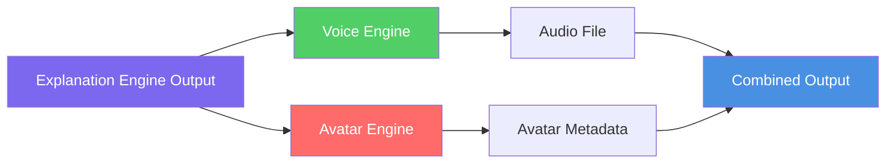
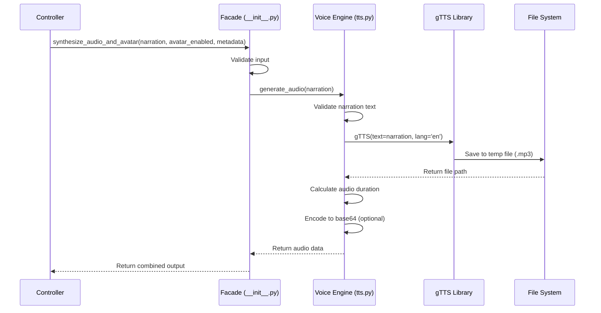
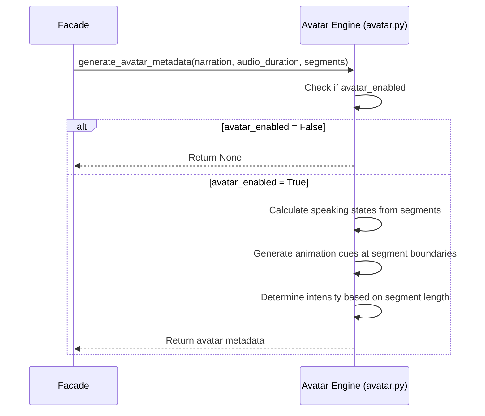

**This design reflects the IMPLEMENTED state of ConversAI V1.**

# ConversAI V1 - Voice & Avatar Engine Design

> [!IMPORTANT]
> This design defines the **Voice & Avatar Engine** for ConversAI. The Voice & Avatar Engine transforms narration text into audio (edge-tts) and generates avatar animation metadata used by the TalkingHead.js 3D avatar on the frontend.

> [!NOTE]
> **Implementation Update**: The original design specified gTTS and a Lottie-based 2D avatar. The **actual implementation** uses **edge-tts** (`en-US-AriaNeural` neural voice) for audio and **TalkingHead.js** with a Ready Player Me GLB model for a real-time 3D lip-synced avatar in the browser.

---

## 1. Voice & Avatar Engine Overview

The Voice & Avatar Engine is a **single backend engine** with two internal components that work together to create an engaging narration experience:

1. **Voice Engine** (`tts.py`) - Converts narration text to audio using gTTS
2. **Avatar Engine** (`avatar.py`) - Generates lightweight avatar metadata for frontend animation control



### 1.1 Why One Engine?

For V1, combining voice and avatar into a single engine is appropriate because:

1. **Shared Input**: Both components operate on the same narration text
2. **Timing Dependency**: Avatar state is directly derived from audio generation
3. **Simplified Orchestration**: Controller makes one call instead of two
4. **V1 Scope**: Avatar is optional and lightweight, not a separate concern
5. **Performance**: No network overhead between voice and avatar processing
6. **Error Handling**: Unified error context for the entire audio/avatar pipeline

### 1.2 Design Philosophy

```
Good audio + avatar for ConversAI:
  ✓ Natural neural voice (Microsoft AriaNeural)
  ✓ 3D WebGL avatar with real-time lip-sync
  ✓ Avatar driven by actual audio ArrayBuffer
  ✓ Gracefully degrades if TalkingHead fails (shows progress bar)
  
Bad audio + avatar for ConversAI:
  ✗ Robotic TTS voice (avoid gTTS monotone)
  ✗ 2D CSS-animated avatars (no lip-sync)
  ✗ Avatar dependency blocking audio playback
  ✗ Complex video generation (too slow)
```

---

## 2. Internal Components

### 2.1 Voice Engine (`tts.py`)

**Purpose**: Convert narration text to speech using **edge-tts** (Microsoft Edge Neural TTS, `en-US-AriaNeural` voice).

**Responsibilities**:
- Receive full narration text from Explanation Engine
- Convert text to audio using `edge.Communicate()` with `en-US-AriaNeural` voice
- Return base64-encoded MP3 audio for transport to frontend
- Calculate actual audio duration from the generated MP3
- Handle TTS errors gracefully

**NOT Responsible For**:
- ❌ Generating narration text
- ❌ Splitting narration into words or phonemes
- ❌ Managing avatar animation
- ❌ Permanent audio storage
- ❌ Audio editing or post-processing

---

### 2.2 Avatar Engine (`avatar.py`)

**Purpose**: Generate lightweight avatar metadata for the TalkingHead.js 3D frontend avatar.

**Responsibilities**:
- Receive narration text and audio duration
- Calculate speaking state timeline (when avatar is "speaking" vs "idle")
- Generate simple animation cues based on narration structure
- Return avatar metadata consumed by the frontend `DigitalHuman` component
- Support avatar toggle (enabled/disabled)

**Frontend Avatar (DigitalHuman.jsx)**:
- Loads TalkingHead.js (`@met4citizen/talkinghead`) from `src/vendor/talkinghead/`
- Loads a Ready Player Me GLB model with ARKit + Oculus Viseme morph targets
- Drives lip-sync by calling `head.speakAudio(audioArrayBuffer)` with the backend's base64 MP3
- Shows a loading progress bar (0-100%) while the GLB model downloads
- Falls back to an error state if TalkingHead initialization fails

**NOT Responsible For**:
- ❌ 3D rendering (handled by TalkingHead.js in browser)
- ❌ AI-based avatar creation
- ❌ Lip-sync analysis (handled by TalkingHead.js internal viseme engine)
- ❌ Frontend UI control
- ❌ Complex character animation

---

## 3. Responsibilities & Non-Responsibilities

### 3.1 Engine Responsibilities (`__init__.py`)

The public facade (`src/engines/voice/__init__.py`) provides:

```python
async def synthesize_audio_and_avatar(
    narration: str,
    avatar_enabled: bool,
    metadata: dict
) -> dict:
    """
    Generate audio and optional avatar metadata from narration.
    
    Orchestrates:
    1. Voice synthesis (tts.py)
    2. Avatar metadata generation (avatar.py) if enabled
    3. Combines outputs into unified response
    """
```

**Facade Responsibilities**:
- Validate input (narration text, avatar toggle)
- Orchestrate calls to tts.py and avatar.py
- Handle component-level errors
- Return unified output schema
- Log execution metadata

**Facade Non-Responsibilities**:
- ❌ Generate narration text
- ❌ Modify narration segments
- ❌ Render avatar visuals
- ❌ Make decisions about content structure

---

### 3.2 Voice Engine Responsibilities (`tts.py`)

**Core Function**:
```python
def generate_audio(narration: str) -> dict:
    """
    Convert narration text to audio using gTTS.
    
    Returns:
        {
            "audio_path": str,      # Temp file path
            "audio_base64": str,    # Base64 encoded audio
            "duration": float,      # Actual audio duration in seconds
            "format": str           # "mp3" or "wav"
        }
    """
```

**Detailed Responsibilities**:
1. **Input Validation**: Check narration is non-empty string
2. **TTS Invocation**: Call gTTS with narration text
3. **Audio Generation**: Create audio file in temp directory
4. **Duration Calculation**: Use audio library to get actual duration
5. **Encoding**: Convert to base64 if needed for transport
6. **Cleanup**: Mark temp files for deletion after response

**Non-Responsibilities**:
- ❌ Text preprocessing (handled by Explanation Engine)
- ❌ Voice selection (use gTTS defaults for V1)
- ❌ Audio effects or filtering
- ❌ Splitting narration by segments

---

### 3.3 Avatar Engine Responsibilities (`avatar.py`)

**Core Function**:
```python
def generate_avatar_metadata(
    narration: str,
    audio_duration: float,
    segments: List[Segment]
) -> dict:
    """
    Generate lightweight avatar animation metadata.
    
    Returns:
        {
            "states": List[AvatarState],
            "cues": List[AnimationCue],
            "metadata": dict
        }
    """
```

**Detailed Responsibilities**:
1. **Speaking State Timeline**: Calculate when avatar is "speaking" vs "idle"
2. **Segment-Based Cues**: Generate animation cues at segment boundaries
3. **Metadata Generation**: Provide simple triggers for frontend animation
4. **Deterministic Logic**: Use segment timing to create predictable states

**Non-Responsibilities**:
- ❌ Lip-sync analysis (not in V1 scope)
- ❌ Video generation
- ❌ AI-based animation
- ❌ Character rendering
- ❌ Frontend animation control

---

## 4. Input Schema

The Voice & Avatar Engine receives the complete output from the Explanation Engine:

```python
# Input Type: VoiceAvatarInput
{
  "narration": str,              # PRIMARY INPUT for voice synthesis
  "segments": List[Segment],     # Used for avatar state timing
  "avatar_enabled": bool,        # Toggle avatar metadata generation
  "metadata": {
    "estimatedDuration": float,  # Expected duration from Explanation Engine
    "concepts": List[str],       # Not directly used, for context
    "difficulty": str            # Not directly used, for context
  }
}

# Segment Type (from Explanation Engine)
class Segment(BaseModel):
    id: str              # "segment_1", "segment_2", ...
    text: str            # Narration text for this segment
    startTime: float     # seconds
    endTime: float       # seconds
```

**Key Input Fields**:

| Field | Purpose |
|-------|---------|
| `narration` | Full narration text for TTS generation |
| `segments` | Used to calculate avatar state transitions |
| `avatar_enabled` | Determines if avatar metadata is generated |
| `metadata.estimatedDuration` | Used for validation and fallback |

---

## 5. Output Schema

### 5.1 Voice & Avatar Engine Output

```python
# Output Type: VoiceAvatarOutput
{
  "audio": str,                  # Base64 encoded audio or file path
  "duration": float,             # Actual audio duration in seconds
  "format": str,                 # "mp3" or "wav"
  "avatar": Optional[AvatarData], # Only if avatar_enabled = True
  "metadata": {
    "generationTime": float,     # Seconds taken to generate
    "hasAvatar": bool,
    "audioSize": int             # Bytes
  }
}
```

### 5.2 Avatar Data Schema

```python
# AvatarData Type (only if avatar_enabled = True)
{
  "states": List[AvatarState],   # Timeline of avatar states
  "cues": List[AnimationCue],    # Animation triggers
  "metadata": {
    "totalDuration": float,
    "stateCount": int
  }
}

# AvatarState Type
class AvatarState(BaseModel):
    startTime: float       # seconds
    endTime: float         # seconds
    state: str             # "speaking" | "idle"
    intensity: str         # "low" | "medium" | "high"

# AnimationCue Type
class AnimationCue(BaseModel):
    timestamp: float       # seconds
    cueType: str           # "segment_start" | "segment_end" | "emphasis"
    metadata: dict         # Additional context
```

**Example Output**:

```python
{
  "audio": "data:audio/mp3;base64,//uQxAAAAAAAAAAAAAAASW5mbwAAAA8AAABa...",
  "duration": 75.2,
  "format": "mp3",
  "avatar": {
    "states": [
      {
        "startTime": 0.0,
        "endTime": 9.6,
        "state": "speaking",
        "intensity": "medium"
      },
      {
        "startTime": 9.6,
        "endTime": 26.4,
        "state": "speaking",
        "intensity": "high"
      },
      {
        "startTime": 26.4,
        "endTime": 75.2,
        "state": "speaking",
        "intensity": "medium"
      }
    ],
    "cues": [
      {
        "timestamp": 0.0,
        "cueType": "segment_start",
        "metadata": {"segmentId": "segment_1"}
      },
      {
        "timestamp": 9.6,
        "cueType": "segment_start",
        "metadata": {"segmentId": "segment_2"}
      }
    ],
    "metadata": {
      "totalDuration": 75.2,
      "stateCount": 3
    }
  },
  "metadata": {
    "generationTime": 2.3,
    "hasAvatar": true,
    "audioSize": 1204800
  }
}
```

---

## 6. Voice Generation Flow

### 6.1 Step-by-Step Voice Synthesis



### 6.2 Voice Generation Implementation Logic

```python
# Pseudocode for voice generation using edge-tts

async def generate_audio(narration: str) -> dict:
    """Generate audio from narration text using edge-tts."""
    
    # Step 1: Input validation
    if not narration or len(narration.strip()) == 0:
        raise VoiceEngineError("Empty narration text")
    
    # Step 2: Initialize edge-tts with AriaNeural voice
    communicate = edge_tts.Communicate(
        text=narration,
        voice="en-US-AriaNeural",
        rate="+0%",
        volume="+0%"
    )
    
    # Step 3: Stream to bytes buffer
    audio_chunks = []
    async for chunk in communicate.stream():
        if chunk["type"] == "audio":
            audio_chunks.append(chunk["data"])
    audio_bytes = b"".join(audio_chunks)
    
    # Step 4: Encode to base64 for transport
    import base64
    audio_base64 = base64.b64encode(audio_bytes).decode('utf-8')
    
    # Step 5: Calculate duration from MP3 bytes
    # (using mutagen or wave library)
    duration = calculate_duration(audio_bytes)  # seconds
    
    # Step 6: Return audio data
    return {
        "audio_base64": audio_base64,  # Raw base64 (no data: URI prefix)
        "duration": duration,
        "format": "mp3",
        "size": len(audio_bytes)
    }
```

### 6.3 Voice Generation Parameters

```python
VOICE_CONFIG = {
    "voice": "en-US-AriaNeural",  # Microsoft Neural TTS voice
    "rate": "+0%",                # Speaking speed (default)
    "volume": "+0%",              # Volume (default)
    "output_format": "mp3",
    "transport": "base64"          # Sent as raw base64 (no data: URI prefix)
}

# edge-tts automatically handles:
# - Natural speech rhythm and prosody
# - Punctuation-based pauses
# - Sentence-level emphasis
# - ~150 words/minute speaking rate
```

---

## 7. Avatar State Flow

### 7.1 Step-by-Step Avatar Metadata Generation



### 7.2 Avatar Metadata Generation Logic

```python
# Pseudocode for avatar metadata generation

def generate_avatar_metadata(
    narration: str,
    audio_duration: float,
    segments: List[Segment]
) -> Optional[dict]:
    """Generate avatar animation metadata."""
    
    # Step 1: Initialize state and cue lists
    states = []
    cues = []
    
    # Step 2: Calculate speaking states from segments
    for segment in segments:
        # Determine intensity based on segment duration
        segment_duration = segment.endTime - segment.startTime
        
        if segment_duration < 10:
            intensity = "low"
        elif segment_duration < 20:
            intensity = "medium"
        else:
            intensity = "high"
        
        # Create speaking state
        state = {
            "startTime": segment.startTime,
            "endTime": segment.endTime,
            "state": "speaking",
            "intensity": intensity
        }
        states.append(state)
        
        # Create segment start cue
        cue = {
            "timestamp": segment.startTime,
            "cueType": "segment_start",
            "metadata": {
                "segmentId": segment.id,
                "text": segment.text[:50]  # First 50 chars for context
            }
        }
        cues.append(cue)
    
    # Step 3: Add final idle state (optional, for smooth ending)
    # Not needed in V1 since narration ends when audio ends
    
    # Step 4: Return avatar metadata
    return {
        "states": states,
        "cues": cues,
        "metadata": {
            "totalDuration": audio_duration,
            "stateCount": len(states)
        }
    }
```

### 7.3 Avatar State Rules

#### State Types

| State | Description | Frontend Behavior |
|-------|-------------|-------------------|
| `speaking` | Avatar is actively narrating | Play speaking Lottie animation |
| `idle` | Avatar is silent (not used in V1) | Play idle Lottie animation |

#### Intensity Levels

| Intensity | Segment Duration | Frontend Effect |
|-----------|------------------|-----------------|
| `low` | < 10 seconds | Subtle animation, slower speed |
| `medium` | 10-20 seconds | Normal animation speed |
| `high` | > 20 seconds | More energetic animation |

**Note**: Intensity is a **frontend hint**, not a backend enforcement. The frontend Lottie player can use this to adjust animation speed or variation.

---

### 7.4 Animation Cue Types

```python
# Cue Type Definitions

ANIMATION_CUES = {
    "segment_start": {
        "description": "Triggered at the start of each narration segment",
        "frontend_action": "Reset animation loop, prepare for new segment"
    },
    "segment_end": {
        "description": "Triggered at the end of each segment (optional for V1)",
        "frontend_action": "Transition to next segment animation"
    },
    "emphasis": {
        "description": "Future use: detect emphasized words (V2+)",
        "frontend_action": "Play emphasis gesture"
    }
}
```

**V1 Cues**: Only `segment_start` is implemented. Other cues are reserved for V2+.

---

## 8. Error Handling & Fallback Strategy

### 8.1 Voice Engine Error Handling

| Error Scenario | Fallback Strategy |
|----------------|-------------------|
| gTTS library fails to initialize | Retry once, then raise VoiceEngineError |
| Audio generation fails | Retry once with shorter text segments, then fail |
| Temp file creation fails | Try alternative temp directory, then fail |
| Duration calculation fails | Use estimated duration from Explanation Engine |
| Empty narration text | Raise validation error immediately |

**Error Response Structure**:

```python
{
  "error": {
    "code": "VOICE_ENGINE_ERROR",
    "message": "Audio generation failed after retries",
    "details": {
      "narration_length": 500,
      "retry_count": 2,
      "last_error": "gTTS timeout"
    }
  }
}
```

---

### 8.2 Avatar Engine Error Handling

| Error Scenario | Fallback Strategy |
|----------------|-------------------|
| Avatar metadata generation fails | Return None (audio still works) |
| Invalid segment timing | Use estimated timing from narration |
| Missing segments | Create single state covering full duration |

**Graceful Degradation**: Avatar failures MUST NOT block audio generation.

```python
# Pseudocode for graceful avatar handling

try:
    avatar_data = generate_avatar_metadata(narration, duration, segments)
except Exception as e:
    logger.warning(f"Avatar generation failed: {e}")
    avatar_data = None  # Continue with audio-only output
```

---

### 8.3 Facade-Level Error Handling

```python
# Unified error handling in facade

async def synthesize_audio_and_avatar(
    narration: str,
    avatar_enabled: bool,
    metadata: dict
) -> dict:
    """Generate audio and avatar with error handling."""
    
    # Step 1: Validate input
    if not narration:
        raise ValidationError("Narration text is required")
    
    # Step 2: Generate audio (critical, must succeed)
    try:
        audio_data = generate_audio(narration)
    except Exception as e:
        logger.error(f"Audio generation failed: {e}")
        raise VoiceEngineError(f"Audio synthesis failed: {e}")
    
    # Step 3: Generate avatar metadata (optional, can fail gracefully)
    avatar_data = None
    if avatar_enabled:
        try:
            avatar_data = generate_avatar_metadata(
                narration, 
                audio_data["duration"], 
                metadata.get("segments", [])
            )
        except Exception as e:
            logger.warning(f"Avatar generation failed, continuing with audio-only: {e}")
            # Continue without avatar
    
    # Step 4: Return combined output
    return {
        "audio": audio_data["audio_base64"],
        "duration": audio_data["duration"],
        "format": audio_data["format"],
        "avatar": avatar_data,
        "metadata": {
            "generationTime": time.time() - start_time,
            "hasAvatar": avatar_data is not None,
            "audioSize": audio_data["size"]
        }
    }
```

---

### 8.4 Retry Logic

```python
# gTTS retry configuration

RETRY_CONFIG = {
    "max_retries": 2,
    "retry_delay": 1.0,  # seconds
    "backoff_factor": 2.0
}

def generate_audio_with_retry(narration: str) -> dict:
    """Generate audio with retry logic."""
    
    for attempt in range(RETRY_CONFIG["max_retries"] + 1):
        try:
            return generate_audio(narration)
        except Exception as e:
            if attempt == RETRY_CONFIG["max_retries"]:
                raise VoiceEngineError(f"Audio generation failed after {attempt + 1} attempts: {e}")
            
            delay = RETRY_CONFIG["retry_delay"] * (RETRY_CONFIG["backoff_factor"] ** attempt)
            logger.warning(f"Audio generation attempt {attempt + 1} failed, retrying in {delay}s: {e}")
            time.sleep(delay)
```

---

## 9. Integration with Other Engines

### 9.1 Input from Explanation Engine

The Voice & Avatar Engine receives:

```python
# From Explanation Engine output
{
  "narration": str,              # Full narration text
  "segments": List[Segment],     # For avatar timing
  "metadata": {
    "estimatedDuration": float
  }
}
```

**Usage**:
- `narration`: Passed directly to gTTS
- `segments`: Used to calculate avatar state timeline
- `estimatedDuration`: Used for validation and fallback

---

### 9.2 Output to Aggregation Engine

The Aggregation Engine receives:

```python
{
  "audio": str,                  # Base64 or file path
  "duration": float,             # Actual duration
  "avatar": Optional[AvatarData]
}
```

**Aggregation Engine responsibilities**:
- Synchronize audio with visuals using `duration`
- Pass avatar metadata to frontend
- Validate timeline consistency

---

### 9.3 Integration Flow Diagram

```mermaid
graph TD
    EE[Explanation Engine] -->|narration, segments| VAE[Voice & Avatar Engine]
    VAE -->|audio base64, duration, avatar| AGG[Aggregation Engine]
    AGG -->|final output| API[API Response]
    API -->|audio base64 + avatar metadata| UI[Frontend]
    UI -->|audio ArrayBuffer| DH[DigitalHuman.jsx]
    DH -->|speakAudio()| TH[TalkingHead.js WebGL]
    TH -->|3D lip-sync animation| Browser[Browser Renderer]
    
    style VAE fill:#51cf66,color:#fff
    style AGG fill:#ffd700,color:#333
    style UI fill:#4a90e2,color:#fff
    style DH fill:#ff6b6b,color:#fff
    style TH fill:#7b68ee,color:#fff
```

---

## 10. Example End-to-End Flow

### Input (from Explanation Engine)

```python
{
  "narration": "Ever wondered how Netflix knows exactly what show you'll binge next? That's machine learning in action—and it's simpler than you think. Machine learning is basically teaching computers to learn from examples, just like how you learned to recognize your friends' faces.",
  "segments": [
    {
      "id": "segment_1",
      "text": "Ever wondered how Netflix knows exactly what show you'll binge next? That's machine learning in action—and it's simpler than you think.",
      "startTime": 0.0,
      "endTime": 9.6
    },
    {
      "id": "segment_2",
      "text": "Machine learning is basically teaching computers to learn from examples, just like how you learned to recognize your friends' faces.",
      "startTime": 9.6,
      "endTime": 26.4
    }
  ],
  "metadata": {
    "estimatedDuration": 26.4
  }
},
"avatar_enabled": true
```

---

### Processing Steps

**Step 1: Voice Engine**
```python
# tts.py generates audio
tts = gTTS(text=narration, lang='en')
tts.save('/tmp/conversai_audio/audio_12345.mp3')

# Result:
{
  "audio_base64": "data:audio/mp3;base64,//uQxAAAAAAAAAAA...",
  "duration": 26.8,  # Actual duration (slightly different from estimate)
  "format": "mp3"
}
```

**Step 2: Avatar Engine**
```python
# avatar.py generates metadata
states = [
  {
    "startTime": 0.0,
    "endTime": 9.6,
    "state": "speaking",
    "intensity": "low"  # < 10 seconds
  },
  {
    "startTime": 9.6,
    "endTime": 26.4,
    "state": "speaking",
    "intensity": "medium"  # 10-20 seconds
  }
]

cues = [
  {"timestamp": 0.0, "cueType": "segment_start", "metadata": {"segmentId": "segment_1"}},
  {"timestamp": 9.6, "cueType": "segment_start", "metadata": {"segmentId": "segment_2"}}
]
```

---

### Final Output

```python
{
  "audio": "data:audio/mp3;base64,//uQxAAAAAAAAAAAAAAASW5mb...",
  "duration": 26.8,
  "format": "mp3",
  "avatar": {
    "states": [
      {
        "startTime": 0.0,
        "endTime": 9.6,
        "state": "speaking",
        "intensity": "low"
      },
      {
        "startTime": 9.6,
        "endTime": 26.4,
        "state": "speaking",
        "intensity": "medium"
      }
    ],
    "cues": [
      {
        "timestamp": 0.0,
        "cueType": "segment_start",
        "metadata": {"segmentId": "segment_1"}
      },
      {
        "timestamp": 9.6,
        "cueType": "segment_start",
        "metadata": {"segmentId": "segment_2"}
      }
    ],
    "metadata": {
      "totalDuration": 26.8,
      "stateCount": 2
    }
  },
  "metadata": {
    "generationTime": 2.1,
    "hasAvatar": true,
    "audioSize": 428032
  }
}
```

---

## 11. Why This Design is Optimal for ConversAI V1

### 11.1 Technical Justification

1. **Simple TTS Integration**
   - gTTS is free, requires no API key
   - Reliable and well-maintained library
   - Natural-sounding voice out of the box
   - No complex configuration needed

2. **Lightweight Avatar Approach**
   - Frontend-controlled Lottie animations (not backend concern)
   - No video generation (performance and complexity avoided)
   - No lip-sync (deferred to V2+)
   - Avatar is truly optional (graceful degradation)

3. **Clear Separation of Concerns**
   - Voice Engine: Audio generation only
   - Avatar Engine: Metadata generation only
   - Frontend: Animation rendering (not backend)

4. **Deterministic and Testable**
   - gTTS behavior is predictable
   - Avatar metadata generation is rule-based
   - No AI/ML models for avatar state (simple timing logic)

---

### 11.2 V1 Scope Alignment

| V1 Scope Requirement | Design Compliance |
|----------------------|-------------------|
| Free and open-source | ✅ gTTS is free, no API costs |
| Backend-driven voice | ✅ TTS happens on backend |
| Frontend-driven avatar | ✅ Avatar metadata only, frontend renders |
| No video generation | ✅ Avatar is Lottie-based |
| No lip-sync | ✅ Simple speaking states only |
| Optional avatar | ✅ Graceful degradation if disabled or failed |
| Minimal dependencies | ✅ gTTS + mutagen only |

---

### 11.3 When to Revisit (V2+)

The Voice & Avatar Engine SHOULD be reconsidered when:

1. **Advanced Voice Options**: User-selectable voices, custom TTS models
2. **Lip-Sync**: AI-based phoneme extraction and mouth shape mapping
3. **AI-Generated Avatars**: Dynamic character generation based on content
4. **Video Avatars**: Pre-rendered or real-time video-based characters
5. **Emotion Detection**: Avatar expressions based on narration sentiment
6. **Multilingual Support**: Multiple language and accent options

**None of these apply to V1**, making the current design optimal.

---

## 12. Public Interface (Facade)

### 12.1 Facade Method (`src/engines/voice/__init__.py`)

```python
from typing import List, Optional, Dict
from src.shared.types import Segment

async def synthesize_audio_and_avatar(
    narration: str,
    avatar_enabled: bool,
    segments: List[Segment] = [],
    metadata: Optional[Dict] = None
) -> dict:
    """
    Generate audio and optional avatar metadata from narration.
    
    Args:
        narration: Full narration text for TTS
        avatar_enabled: Whether to generate avatar metadata
        segments: Narration segments for avatar timing (optional)
        metadata: Additional context from Explanation Engine (optional)
    
    Returns:
        {
            "audio": str,              # Base64 encoded audio
            "duration": float,         # Actual audio duration
            "format": str,             # Audio format ("mp3")
            "avatar": Optional[dict],  # Avatar metadata if enabled
            "metadata": {
                "generationTime": float,
                "hasAvatar": bool,
                "audioSize": int
            }
        }
    
    Raises:
        VoiceEngineError: If audio generation fails
        ValidationError: If input is invalid
    """
    pass
```

---

### 12.2 Controller Integration

```python
# In explanation_controller.py

# Step 1: Get explanation output
explanation_output = await explanation_engine.process(text, duration, instruction)

# Step 2: Generate visuals
visual_output = await visual_engine.generate_visuals(
    segments=explanation_output["segments"],
    metadata=explanation_output["metadata"]
)

# Step 3: Generate audio and avatar
voice_output = await voice_engine.synthesize_audio_and_avatar(
    narration=explanation_output["narration"],
    avatar_enabled=request.avatarEnabled,
    segments=explanation_output["segments"],
    metadata=explanation_output["metadata"]
)

# Step 4: Pass to aggregation engine
final_output = await aggregation_engine.compose(
    audio=voice_output["audio"],
    visuals=visual_output["visuals"],
    avatar=voice_output["avatar"],
    segments=explanation_output["segments"]
)
```

---

## 13. Performance Considerations

### 13.1 Audio Generation Time

```
Expected generation time:
- gTTS API call: 1-3 seconds
- File I/O: 0.1-0.5 seconds
- Duration calculation: 0.1 seconds
- Base64 encoding: 0.2-0.5 seconds

Total per request: 1.5-4.5 seconds
```

### 13.2 File Management

```python
AUDIO_FILE_CONFIG = {
    "temp_directory": "/tmp/conversai_audio",
    "format": "mp3",
    "cleanup_strategy": "delete_after_response",
    "max_file_age": 3600  # 1 hour (safety cleanup)
}

# Cleanup logic
def cleanup_temp_audio():
    """Remove audio files older than max_file_age."""
    # Runs periodically via background task
    pass
```

### 13.3 Memory Considerations

```python
# Base64 encoding size estimation
# 1 minute of MP3 audio ≈ 1 MB
# Base64 increases size by ~33%
# 1 minute audio → ~1.33 MB in response

# For V1 with max 90 seconds:
# Max audio size: ~2 MB base64
# Acceptable for JSON response
```

---

## 14. Frontend Integration (Context Only)

> [!NOTE]
> The following describes frontend expectations but is NOT part of the backend design scope.

### Frontend Responsibilities

1. **Audio Playback**
   - Decode base64 audio
   - Use HTML5 Audio API for playback
   - Synchronize with visuals using timestamps

2. **Avatar Animation**
   - Load Lottie animation file (character design)
   - Use avatar states to control animation playback
   - Transition between "speaking" and "idle" states
   - Adjust animation speed based on intensity

3. **Synchronization**
   - Use audio currentTime to determine active state
   - Trigger animation cues at specified timestamps
   - Handle avatar toggle (show/hide)

**Backend does NOT**:
- ❌ Select Lottie animation files
- ❌ Control animation playback
- ❌ Render avatar visuals
- ❌ Synchronize audio and animation (frontend responsibility)

---

## 15. Summary

| Aspect | Design Decision |
|--------|-----------------|
| **Architecture** | Single engine with two internal components (voice + avatar) |
| **Voice Strategy** | gTTS for text-to-speech, backend-generated audio |
| **Avatar Strategy** | Lightweight metadata for frontend Lottie rendering |
| **Default Behavior** | Audio always generated, avatar optional |
| **TTS Library** | gTTS (Google Text-to-Speech) |
| **Output Format** | MP3 audio, base64-encoded |
| **Avatar Format** | JSON metadata with states and cues |
| **Error Handling** | Fail-critical for audio, fail-soft for avatar |

---

## 16. Complete Flow Diagram

```
┌──────────────────────────────────────────────────────────────┐
│ Step 1: Controller → Voice & Avatar Engine                  │
│ Input: narration, segments, avatar_enabled                  │
└──────────────────────────────────────────────────────────────┘
                            ↓
┌──────────────────────────────────────────────────────────────┐
│ Step 2: Voice Engine (tts.py)                               │
│                                                              │
│ narration → gTTS → audio file → duration → base64           │
│                                                              │
│ Output: {audio, duration, format}                           │
└──────────────────────────────────────────────────────────────┘
                            ↓
┌──────────────────────────────────────────────────────────────┐
│ Step 3: Avatar Engine (avatar.py)                           │
│ (Only if avatar_enabled = True)                             │
│                                                              │
│ segments → speaking states → animation cues → metadata      │
│                                                              │
│ Output: {states, cues, metadata}                            │
└──────────────────────────────────────────────────────────────┘
                            ↓
┌──────────────────────────────────────────────────────────────┐
│ Step 4: Facade Combines Outputs                             │
│                                                              │
│ Combine audio + avatar → unified response                   │
└──────────────────────────────────────────────────────────────┘
                            ↓
┌──────────────────────────────────────────────────────────────┐
│ Step 5: Return to Controller                                │
│ Output: {audio, duration, format, avatar, metadata}         │
└──────────────────────────────────────────────────────────────┘
```

This design ensures ConversAI V1 delivers natural-sounding narration with optional lightweight avatar support, maintaining simplicity and performance while enabling future extensibility.
