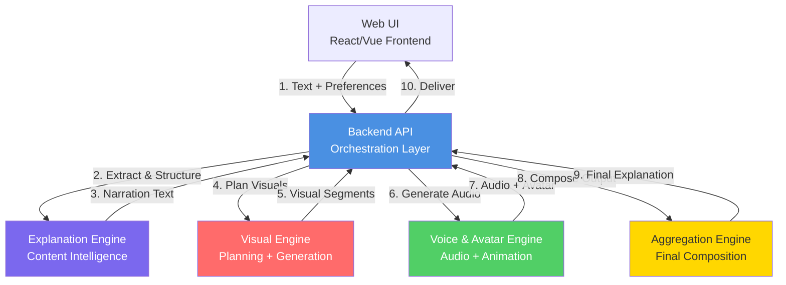

**This architecture is frozen for ConversAI V1.**  
**Any new capability belongs to V2+.**

# ConversAI V1 - System Architecture Document

> [!IMPORTANT]
> This architecture is designed as a **modular monolith** using only free and open-source tools. It is scoped strictly for V1 and avoids features like authentication, databases, PDFs, or microservices.

---

## 1. High-Level System Architecture

ConversAI V1 follows a **backend-orchestrated pipeline architecture** where all intelligence and coordination resides in the backend. The frontend is purely a presentation layer.



### Architecture Principles

1. **Single Responsibility**: Each engine owns one domain
2. **Backend Orchestration**: API coordinates all engines sequentially
3. **Stateless Modules**: No shared state between engines
4. **Interface-Driven**: Engines expose clear input/output contracts
5. **V1 Simplicity**: No premature abstraction

---

## 2. Backend Folder/Module Structure

```
conversai-backend/
│
├── src/
│   ├── api/                          # API Orchestration Layer
│   │   ├── routes/
│   │   │   ├── explanation.py         # POST /api/explain
│   │   │   └── health.py              # GET /api/health
│   │   ├── controllers/
│   │   │   └── explanation_controller.py  # Orchestrates pipeline
│   │   ├── middleware/
│   │   │   ├── validator.py           # Input validation
│   │   │   └── error_handler.py       # Error formatting
│   │   └── main.py                    # FastAPI app entry point
│   │
│   ├── engines/
│   │   ├── explanation/               # Explanation Engine
│   │   │   ├── __init__.py            # Public interface
│   │   │   ├── analyzer.py            # Content analysis
│   │   │   ├── structurer.py          # Story-driven structuring
│   │   │   └── narrator.py            # Narration text generation
│   │   │
│   │   ├── visual/                    # Visual Planning & Generation
│   │   │   ├── __init__.py            # Public interface
│   │   │   ├── planner.py             # Segment → visual mapping
│   │   │   └── generator.py           # Image generation (Stable Diffusion)
│   │   │
│   │   ├── voice/                     # Voice & Avatar Engine
│   │   │   ├── __init__.py            # Public interface
│   │   │   ├── tts.py                 # Text-to-speech (Coqui TTS)
│   │   │   └── avatar.py              # Avatar rendering (conditional)
│   │   │
│   │   └── aggregation/               # Aggregation & Composition
│   │       ├── __init__.py            # Public interface
│   │       ├── synchronizer.py        # Audio-visual sync
│   │       └── composer.py            # Final output assembly
│   │
│   ├── shared/                        # Cross-cutting utilities
│   │   ├── config.py                  # Environment config
│   │   ├── logger.py                  # Logging utility
│   │   └── types.py                   # Shared type definitions
│   │
│   └── __init__.py                    # Package initializer
│
├── tests/                             # Unit & integration tests
│   ├── api/
│   ├── engines/
│   └── integration/
│
├── docs/                              # Documentation
│   ├── api-spec.md                    # API contracts
│   └── engine-interfaces.md           # Engine I/O contracts
│
├── requirements.txt                   # Python dependencies
├── pyproject.toml                     # Project configuration
└── README.md
```

---

## 3. Module Responsibilities & Boundaries

### 3.1 Web UI (Frontend)

**Responsibilities:**
- Landing page with product explanation
- Text input area + preferences UI (duration, style, avatar toggle)
- Explanation playback interface (audio player + visual display + avatar)
- Follow-up question input (V1: simple text input, no AI processing)

**Boundaries (MUST NOT):**
- ❌ Process or analyze user text
- ❌ Generate content or visuals
- ❌ Store user data or sessions
- ❌ Implement authentication
- ❌ Call AI models directly

**Technology:** React + Vite, Vanilla CSS (CSS Variables), Framer Motion, Lucide React, HTML5 Audio API, TalkingHead.js (Three.js WebGL)

---

### 3.2 Backend API (Orchestration Layer)

**Responsibilities:**
- Receive `/api/explain` requests from UI
- Validate input (text length, preferences format)
- Orchestrate sequential calls to engines
- Handle errors and return structured responses
- Provide health check endpoint

**Boundaries (MUST NOT):**
- ❌ Contain business logic (explanation, visuals, audio)
- ❌ Generate content itself
- ❌ Store user data (no database)
- ❌ Make decisions about content structure

**Key Files:**
- `explanation_controller.py` - Orchestrates the pipeline
- `validator.py` - Input sanitization

**Technology:** Python + FastAPI

---

### 3.3 Explanation Engine

**Responsibilities:**
- Analyze input text to extract core concepts
- Restructure content into a **story-driven explanation**
- Generate narration text aligned with:
  - User's selected duration (short/medium)
  - User's instruction (e.g., "explain like I'm a beginner")
- Output: Structured narration with timestamps/segments

**Boundaries (MUST NOT):**
- ❌ Generate visuals or audio
- ❌ Interact with UI directly
- ❌ Store user data
- ❌ Make API calls outside its scope

**Internal Components:**
- `analyzer.py` - Concept extraction using LLM
- `structurer.py` - Story-driven content organization
- `narrator.py` - Narration text generation

**Technology:** Google Gemini (default), Ollama (fallback for local inference)

---

### 3.4 Visual Planning & Generation Engine

**Responsibilities:**
- Receive narration segments from Explanation Engine
- Generate a vivid cinematic **image prompt** (2-3 sentence scene description) for each segment via Gemini
- Build Pollinations.ai CDN URLs from the prompts (1280×720, 16:9, no API key needed)
- **Pre-warm** all image URLs concurrently via async HTTP requests so images are CDN-cached before the frontend renders
- Output: Array of visuals with Pollinations.ai `url`, `headline`, `imagePrompt`, and segment timestamps

**Boundaries (MUST NOT):**
- ❌ Generate narration text
- ❌ Generate audio
- ❌ Decide explanation structure
- ❌ Store images locally (URL-based, CDN-served)

**Internal Components:**
- `planner.py` - Uses Gemini to generate image prompts + builds Pollinations.ai URLs + pre-warming
- `generator.py` - Attaches URLs + metadata to Visual objects

**Technology:** Google Gemini (image prompt generation), Pollinations.ai (free AI image CDN, `image.pollinations.ai`)

---

### 3.5 Voice & Avatar Engine

**Responsibilities:**
- Convert narration text to high-quality audio using **edge-tts** (Microsoft Edge TTS, `en-US-AriaNeural` voice)
- Conditionally generate avatar animation metadata (states, cues) per segment
- Output: Base64 MP3 audio + optional avatar states metadata

**Boundaries (MUST NOT):**
- ❌ Generate narration text
- ❌ Generate visuals (non-avatar)
- ❌ Decide explanation structure
- ❌ Render the 3D avatar (frontend responsibility via TalkingHead.js)

**Internal Components:**
- `tts.py` - Text-to-speech via edge-tts (`en-US-AriaNeural`), base64 MP3 output
- `avatar.py` - Lightweight avatar state metadata (speaking/idle, intensity per segment)

**Frontend Avatar (TalkingHead.js):**
- A React `DigitalHuman` component loads TalkingHead.js (Three.js WebGL)
- Loads a Ready Player Me GLB avatar model
- Drives real-time lip-sync via `head.speakAudio(audioArrayBuffer)`
- All 3D rendering happens in the browser, not the backend

**Technology (Backend):** edge-tts (Microsoft Neural TTS, free, no API key)  
**Technology (Frontend):** TalkingHead.js (`@met4citizen/talkinghead`), Three.js, Ready Player Me GLB

---

### 3.6 Aggregation / Composition Engine

**Responsibilities:**
- Receive:
  - Narration audio
  - Visuals with timestamps
  - Avatar stream (if enabled)
- Synchronize all assets on a timeline
- Compose final multimodal explanation output
- Output: Unified JSON structure with:
  - Audio URL/base64
  - Visuals array with timestamps
  - Avatar data (if enabled)
  - Metadata (duration, segment count)

**Boundaries (MUST NOT):**
- ❌ Generate content (audio, visuals, narration)
- ❌ Modify explanation structure
- ❌ Store final output (V1: return to API immediately)

**Internal Components:**
- `synchronizer.py` - Timeline alignment logic
- `composer.py` - Final JSON assembly

**Technology:** Pure JavaScript/Python for data composition

---

## 4. Data Flow Pipeline (Textual)

### Request Flow

```
┌─────────────────────────────────────────────────────────────────┐
│ Step 1: User Input (Web UI → Backend API)                      │
├─────────────────────────────────────────────────────────────────┤
│ Input:                                                          │
│   - text: "Quantum entanglement is..."                         │
│   - duration: "medium"                                          │
│   - instruction: "Explain like I'm a beginner"                 │
│   - avatarEnabled: true                                         │
│                                                                 │
│ Validation:                                                     │
│   - Text length (100-5000 chars)                               │
│   - Duration enum check                                         │
│   - Instruction sanitization                                    │
└─────────────────────────────────────────────────────────────────┘
                              ↓
┌─────────────────────────────────────────────────────────────────┐
│ Step 2: Explanation Generation (API → Explanation Engine)      │
├─────────────────────────────────────────────────────────────────┤
│ Input: {text, duration, instruction}                           │
│                                                                 │
│ Processing:                                                     │
│   1. analyzer.py extracts core concepts                        │
│   2. structurer.py creates story arc                           │
│   3. narrator.py generates timed narration text                │
│                                                                 │
│ Output:                                                         │
│   {                                                             │
│     narration: "Let's explore quantum entanglement...",        │
│     segments: [                                                 │
│       {text: "...", startTime: 0, endTime: 15},                │
│       {text: "...", startTime: 15, endTime: 30}                │
│     ],                                                          │
│     metadata: {concepts: [...], difficulty: "beginner"}        │
│   }                                                             │
└─────────────────────────────────────────────────────────────────┘
                              ↓
┌─────────────────────────────────────────────────────────────────┐
│ Step 3: Visual Planning (API → Visual Engine)                  │
├─────────────────────────────────────────────────────────────────┤
│ Input: {segments, metadata}                                    │
│                                                                 │
│ Processing:                                                     │
│   1. planner.py maps each segment to visual type              │
│   2. generator.py creates images via Stable Diffusion          │
│                                                                 │
│ Output:                                                         │
│   {                                                             │
│     visuals: [                                                  │
│       {url: "data:image/png...", startTime: 0, type: "diagram"},│
│       {url: "data:image/png...", startTime: 15, type: "stock_photo"}│
│     ]                                                           │
│   }                                                             │
└─────────────────────────────────────────────────────────────────┘
                              ↓
┌─────────────────────────────────────────────────────────────────┐
│ Step 4: Audio & Avatar Generation (API → Voice Engine)         │
├─────────────────────────────────────────────────────────────────┤
│ Input: {narration, avatarEnabled}                              │
│                                                                 │
│ Processing:                                                     │
│   1. tts.py converts narration to audio                        │
│   2. avatar.py syncs lip movements (if enabled)                │
│                                                                 │
│ Output:                                                         │
│   {                                                             │
│     audio: "data:audio/mp3;base64...",                         │
│     avatar: {frames: [...], phonemes: [...]}, // if enabled    │
│     duration: 45.3                                              │
│   }                                                             │
└─────────────────────────────────────────────────────────────────┘
                              ↓
┌─────────────────────────────────────────────────────────────────┐
│ Step 5: Final Composition (API → Aggregation Engine)           │
├─────────────────────────────────────────────────────────────────┤
│ Input: {audio, visuals, avatar, segments}                      │
│                                                                 │
│ Processing:                                                     │
│   1. synchronizer.py aligns visuals to audio timeline          │
│   2. composer.py assembles final JSON                          │
│                                                                 │
│ Output:                                                         │
│   {                                                             │
│     audio: "...",                                               │
│     visuals: [{url, startTime, endTime}],                      │
│     avatar: {...},                                              │
│     metadata: {duration, segmentCount, hasAvatar}              │
│   }                                                             │
└─────────────────────────────────────────────────────────────────┘
                              ↓
┌─────────────────────────────────────────────────────────────────┐
│ Step 6: Response Delivery (API → Web UI)                       │
├─────────────────────────────────────────────────────────────────┤
│ UI receives final explanation object and plays it              │
└─────────────────────────────────────────────────────────────────┘
```

### Error Handling Flow

```
Any Engine Failure
       ↓
Returns error to API
       ↓
API logs error + returns structured error response
       ↓
UI displays user-friendly error message
```

---

## 5. Engine Interfaces (Input/Output Contracts)

### Explanation Engine

```javascript
// Input
{
  text: string,           // User's pasted content
  duration: "short" | "medium",
  instruction: string     // Optional user instruction
}

// Output
{
  narration: string,      // Full narration text
  segments: [
    {
      text: string,
      startTime: number,  // seconds
      endTime: number
    }
  ],
  metadata: {
    concepts: string[],
    difficulty: string,
    estimatedDuration: number
  }
}
```

### Visual Engine

```python
# Input
{
  "segments": List[Segment],
  "metadata": {
    "concepts": List[str],
    "difficulty": str
  }
}

# Output
{
  "visuals": [
    {
      "url": str,        # base64 or temp file path
      "startTime": float,
      "endTime": float,
      "type": "diagram" | "illustration" | "chart" | "icon" | "stock_photo" | "infographic" | "typography" | "cutout_collage"
    }
  ]
}
```

### Voice & Avatar Engine

```javascript
// Input
{
  narration: string,
  avatarEnabled: boolean
}

// Output
{
  audio: string,          // base64 or file path
  duration: number,       // seconds
  avatar?: {              // Only if avatarEnabled
    frames: AnimationFrame[],
    phonemes: PhonemeData[]
  }
}
```

### Aggregation Engine

```javascript
// Input
{
  audio: string,
  visuals: Visual[],
  avatar?: AvatarData,
  segments: Segment[]
}

// Output
{
  audio: string,
  visuals: Visual[],      // Synchronized to audio
  avatar?: AvatarData,
  metadata: {
    duration: number,
    segmentCount: number,
    hasAvatar: boolean
  }
}
```

---

## 6. Technology Stack (V1)

| Component | Technology | Rationale |
|-----------|-----------|-----------|
| **Backend Framework** | Python + FastAPI | Fast, async support, great for AI workloads |
| **Frontend Framework** | React + Vite | Modern, fast build, excellent DX |
| **Frontend Styling** | Vanilla CSS + CSS Variables | Full design control, no framework overhead |
| **UI Animations** | Framer Motion | Declarative, smooth state transitions |
| **UI Icons** | Lucide React | Professional SVG icons, tree-shakeable, MIT |
| **LLM** | Google Gemini (`gemini-2.0-flash-preview`) | Free tier, fast, multimodal capable |
| **Image Generation** | Pollinations.ai (`image.pollinations.ai`) | Free, no API key, CDN-cached, 1280×720 |
| **Text-to-Speech** | edge-tts (`en-US-AriaNeural`) | Free Microsoft Neural TTS, natural voice |
| **3D Avatar** | TalkingHead.js + Ready Player Me | Free, real-time lip-sync via Three.js WebGL |
| **Observability** | SQLite + local artifact files | Zero-dependency, queryable, git-safe |
| **Testing (Backend)** | pytest | Python standard for testing |
| **Testing (Frontend)** | Vitest | Fast, Vite-native testing |

---

## 7. Deployment Architecture (V1)

```
┌─────────────────────────────────────────────┐
│           Single Server / VM                │
│                                             │
│  ┌─────────────────────────────────────┐   │
│  │  Web UI (React + Vite Build)        │   │
│  │  Served via FastAPI static files    │   │
│  └─────────────────────────────────────┘   │
│                                             │
│  ┌─────────────────────────────────────┐   │
│  │  Backend API (FastAPI Server)       │   │
│  │  Port: 8000                         │   │
│  └─────────────────────────────────────┘   │
│                                             │
│  ┌─────────────────────────────────────┐   │
│  │  Ollama Service (LLM Inference)     │   │
│  │  Port: 11434                        │   │
│  └─────────────────────────────────────┘   │
│                                             │
│  ┌─────────────────────────────────────┐   │
│  │  Stable Diffusion (Integrated)      │   │
│  │  Runs within FastAPI process        │   │
│  └─────────────────────────────────────┘   │
└─────────────────────────────────────────────┘
```

**Notes:**
- No database required (stateless)
- No persistent storage (temp files cleared after response)
- All services run on single machine for V1 simplicity

---

## 8. Future Extensibility Points (NOT V1)

> [!NOTE]
> These are documented for future reference but **MUST NOT** be implemented in V1.

| Extension Point | How Current Design Supports It |
|----------------|--------------------------------|
| PDF Upload | Add preprocessing module before Explanation Engine |
| User Accounts | Add authentication middleware in API layer |
| Database | Add persistence layer; engines remain unchanged |
| Real-time Interaction | Add WebSocket layer; engines output streaming data |
| Microservices | Each engine already has clear interface; wrap in REST/gRPC |
| Advanced Avatars | Swap avatar.js implementation; interface stays same |

---

## 9. Non-Functional Requirements

### Performance
- **Target Response Time**: < 60 seconds for medium duration
- **Concurrent Users**: 10 (V1 single-server limitation)
- **Max Input Length**: 5000 characters

### Reliability
- **Error Recovery**: Each engine fails independently; API returns partial results if possible
- **Logging**: All engines log to central logger

### Security
- **Input Sanitization**: Validate and sanitize all user inputs
- **No PII Storage**: No user data persisted
- **Rate Limiting**: Basic IP-based rate limiting (100 requests/hour)

---

## 10. Summary

ConversAI V1 is a **modular monolith** where:

1. **Backend API** is the single orchestrator
2. **Four specialized engines** handle distinct responsibilities:
   - Explanation Engine: Content → Story-driven narration (Google Gemini)
   - Visual Engine: Narration → AI-generated cinematic images (Gemini prompts + Pollinations.ai)
   - Voice & Avatar Engine: Narration → Neural audio (edge-tts) + Avatar metadata
   - Aggregation Engine: Assets → Unified multimodal output
3. **Frontend Digital Human**: TalkingHead.js 3D avatar with real-time lip-sync in the browser
4. **No databases, no authentication, no microservices** (V1 scope constraints)
5. **Entirely free tools** throughout the stack — zero API costs
6. **Clear interfaces** enable future extensibility without architectural rewrites

This architecture is **interview-ready**, **explainable in 5 minutes**, and **implementable by a small team**.
